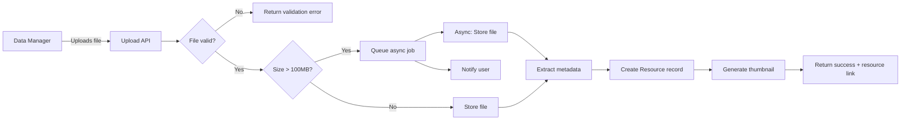
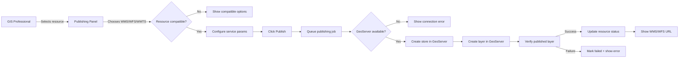
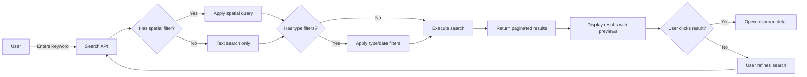
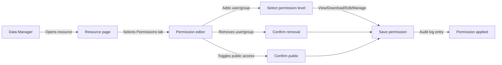
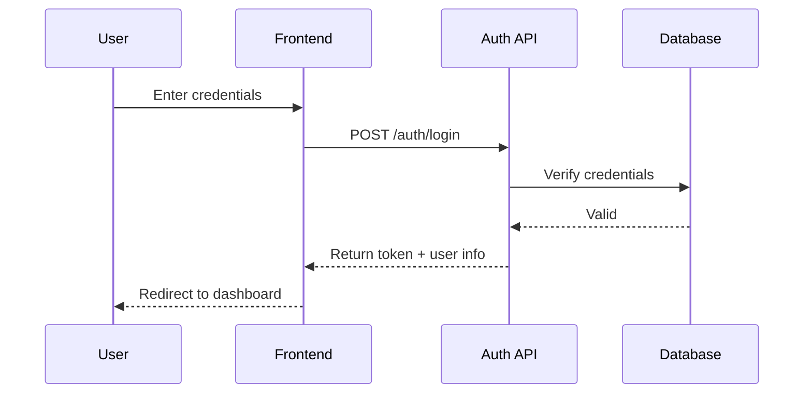

# GeoSpatial Resource Platform — Workflows

Version: 1.0

Status: Draft

Purpose:
Document the key system workflows from actor action through system response.

---

# Workflow 01 — Resource Ingestion

## Overview

A Data Manager uploads a file, the system processes it, and a Resource is created.

## Steps

## Exception Paths

- Invalid format: return error with supported formats list
- Storage failure: return error with retry option
- Metadata extraction partial: proceed with available metadata, flag missing fields

---

# Workflow 02 — Resource Publishing

## Overview

A GIS Professional publishes a resource as an OGC service via GeoServer.

## Steps

## Exception Paths

- GeoServer unreachable: queue job for retry, show connection status
- Publishing partial: report which services succeeded and failed
- Resource modified during publishing: warn user

---

# Workflow 03 — Resource Search

## Overview

A user searches the catalog using keywords and filters.

## Steps

## Exception Paths

- Search service unavailable: show cached results or friendly error
- No results: show suggestions and alternative searches
- Query timeout: simplify query, alert user

---

# Workflow 04 — Access Control

## Overview

A Data Manager sets permissions on a resource.

## Steps

## Exception Paths

- User does not exist: show error, allow correction
- Cannot remove last manager: warn, require confirmation

---

# Workflow 05 — User Authentication

## Overview

A user logs into the platform.

## Steps

## Exception Paths

- Invalid credentials: return error, allow retry
- Account deactivated: show deactivation message
- Rate limit exceeded: show rate limit warning
