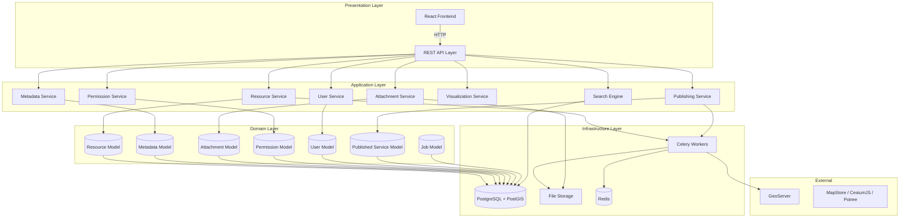
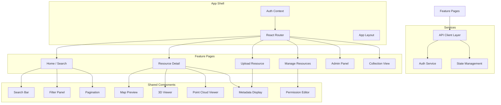
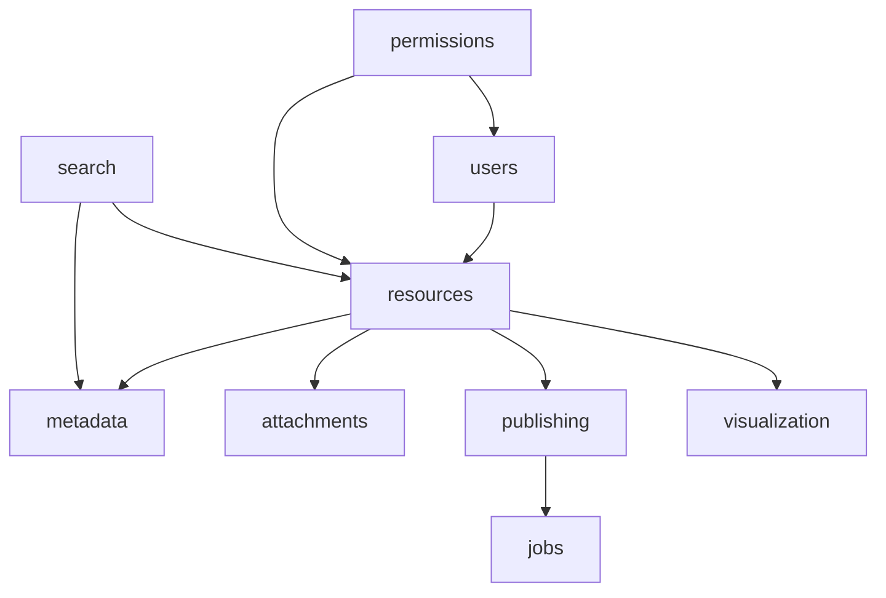

# GeoSpatial Resource Platform — Component Design

Version: 1.0

Status: Draft

Purpose:
Define the internal module boundaries, responsibilities, and interfaces.

---

# Module Architecture

The backend is organized into Django apps representing business capabilities.

---

# Django Application Modules

## resources

Purpose:
Resource lifecycle management.

Responsibilities:
- CRUD operations for Resource entities
- Resource type validation
- Resource status transitions (draft → published → archived)
- Resource search indexing triggers

Models:
- Resource
- ResourceType (enum)
- ResourceStatus (enum)

Dependencies:
- users (owner reference)
- attachments (files)
- metadata (descriptive data)

---

## metadata

Purpose:
Flexible metadata management.

Responsibilities:
- Key-value metadata storage
- Automatic metadata extraction from files
- Metadata validation
- Metadata export

Models:
- Metadata

Dependencies:
- resources

---

## attachments

Purpose:
File storage abstraction.

Responsibilities:
- File upload and storage
- Storage backend abstraction (local/S3)
- File type validation
- File download with permission checks
- Thumbnail generation

Models:
- Attachment

Dependencies:
- resources
- permissions

---

## permissions

Purpose:
Object-level access control.

Responsibilities:
- Resource permission CRUD
- Permission checking at API level
- Group-based permission management
- Public access toggle

Models:
- ResourcePermission
- PermissionLevel (enum)

Dependencies:
- resources
- users

---

## publishing

Purpose:
Publishing orchestration.

Responsibilities:
- Publisher abstraction interface
- GeoServer integration (create stores, layers, styles)
- Publishing job management
- Publishing status tracking
- Service URL management

Models:
- PublishedService
- ServiceType (enum)
- ServiceStatus (enum)

Dependencies:
- resources
- jobs

Interfaces:
- Publisher (abstract base)

---

## visualization

Purpose:
Viewer coordination.

Responsibilities:
- Viewer selection based on resource type
- Viewer plugin interface
- Viewer configuration generation
- URL generation for embedded viewers

Models:
- (Stateless — configuration only)

Dependencies:
- resources

Interfaces:
- Viewer (abstract base)

---

## users

Purpose:
User and group management.

Responsibilities:
- User registration and authentication
- Group management
- Role definitions
- Session management

Models:
- User
- Group
- Role

Dependencies:
- None (foundational)

---

## search

Purpose:
Resource discovery.

Responsibilities:
- Full-text search indexing
- Spatial search queries
- Faceted filtering
- Search result ranking
- Pagination

Models:
- (Uses Resource model and search index)

Dependencies:
- resources
- metadata

---

## jobs

Purpose:
Background job management.

Responsibilities:
- Job creation and tracking
- Job status reporting
- Job result storage
- Error handling and retry

Models:
- Job
- JobStatus (enum)

Dependencies:
- Celery infrastructure

---

# Frontend Architecture

---

# Module Dependency Rules

1. Modules may depend on modules at the same or lower layer
2. No circular dependencies between Django apps
3. Domain models should not import from infrastructure modules
4. Application services should depend on interfaces, not concrete implementations
5. The `resources` module is the center of the dependency graph

