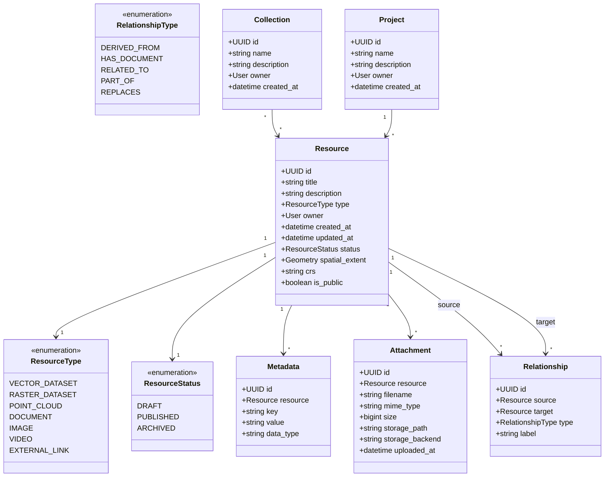
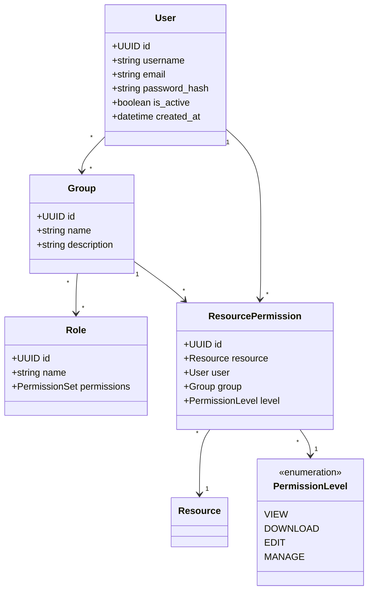
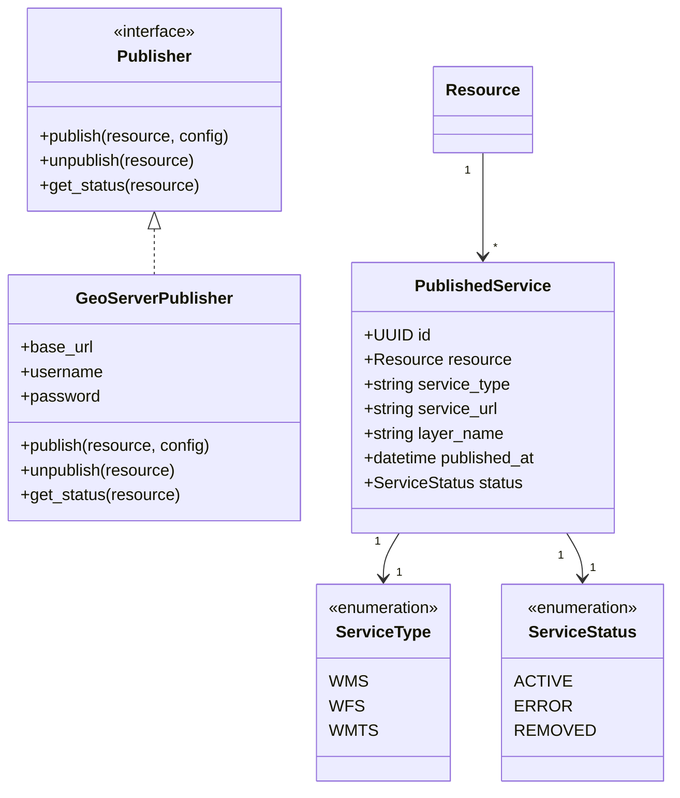
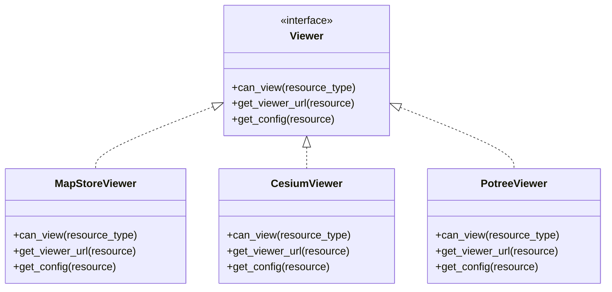
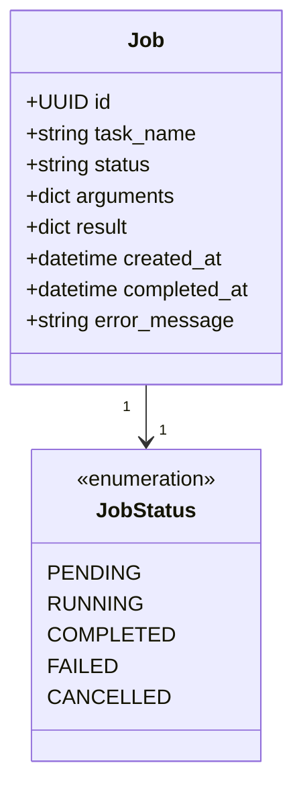

# GeoSpatial Resource Platform — Domain Model

Version: 1.0

Status: Draft

Purpose:
Define the core domain entities, their relationships, and boundaries.

---

# Core Domain

The platform centers around the **Resource** entity.

---

# Identity and Access Domain

---

# Publishing Domain

---

# Visualization Domain

---

# Job Domain

---

# Domain Boundaries Summary

| Module | Core Entities | Responsibility |
|---|---|---|
| Resources | Resource, ResourceType, ResourceStatus | Resource lifecycle |
| Metadata | Metadata | Flexible metadata key-value store |
| Attachments | Attachment | File storage abstraction |
| Relationships | Relationship, RelationshipType | Links between resources |
| Organization | Collection, Project | Resource grouping |
| Identity | User, Group, Role | Users and authentication |
| Permissions | ResourcePermission, PermissionLevel | Object-level access control |
| Publishing | Publisher (interface), GeoServerPublisher, PublishedService | OGC service publishing |
| Visualization | Viewer (interface), MapStoreViewer, CesiumViewer, PotreeViewer | Resource visualization |
| Jobs | Job, JobStatus | Background processing |
