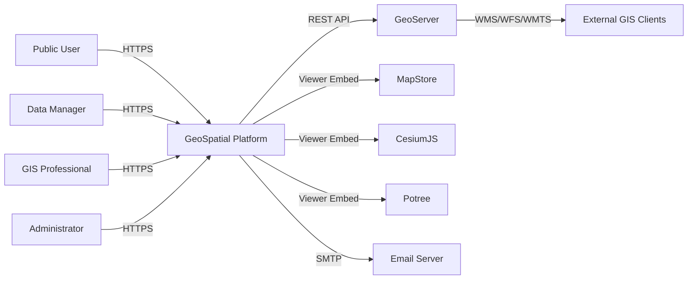
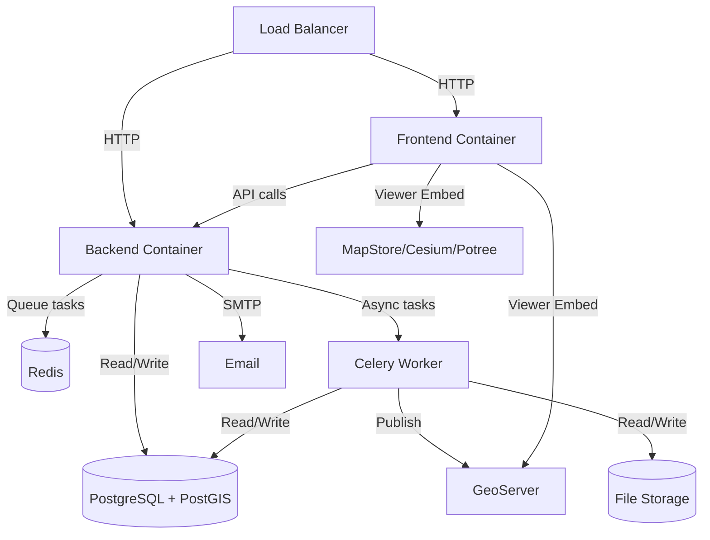

# GeoSpatial Resource Platform — System Overview

Version: 1.0

Status: Draft

Purpose:
Describe the high-level system architecture, boundaries, and external integrations.

---

# System Context

The GeoSpatial Resource Platform is a web-based system that enables organizations to manage, discover, visualize, publish, and share geospatial and non-geospatial resources.

---

# Architecture Style

**Modular Monolith**

The system is deployed as a single application but organized into internal modules with clear boundaries.

Rationale:
- Simpler deployment than microservices
- Clear module boundaries allow future extraction
- Lower initial operational complexity
- Consistent with architectural decision DEC-002

---

# Technology Stack

## Backend

| Component | Technology | Purpose |
|---|---|---|
| Web Framework | Django 5 | HTTP handling, ORM, admin |
| API Layer | Django REST Framework | REST API endpoints |
| Task Queue | Celery | Background job processing |
| Message Broker | Redis | Job queue and caching |
| Database | PostgreSQL + PostGIS | Relational + spatial data |
| File Storage | Local / S3 (abstracted) | Resource file storage |

## Frontend

| Component | Technology | Purpose |
|---|---|---|
| Framework | React + TypeScript | UI components |
| UI Library | Material UI | Design system |
| State Management | React Context / Redux | Client state |
| Map Viewer | MapStore | 2D map visualization |
| 3D Viewer | CesiumJS | 3D globe visualization |
| Point Cloud Viewer | Potree | Point cloud visualization |

## External Systems

| System | Purpose | Integration |
|---|---|---|
| GeoServer | OGC service publishing | REST API |
| MapStore | 2D map viewer | Embedded iframe/API |
| CesiumJS | 3D globe viewer | Library integration |
| Potree | Point cloud viewer | Library integration |

---

# System Boundaries

## Inside the Platform

- Resource management and lifecycle
- Metadata management
- Search and discovery
- User and permission management
- Publishing orchestration
- Visualization coordination
- Background job processing
- Audit logging
- File storage management

## Outside the Platform

- OGC service rendering (GeoServer)
- Tile generation and caching (GeoServer)
- Advanced GIS analysis (desktop GIS tools)
- Authentication provider (future LDAP/SSO)

---

# Deployment Overview

All components are containerized and deployable on a single host or small cluster.
