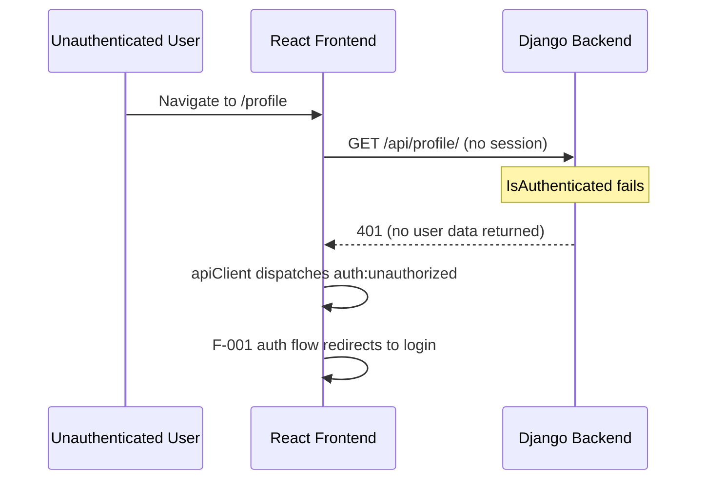
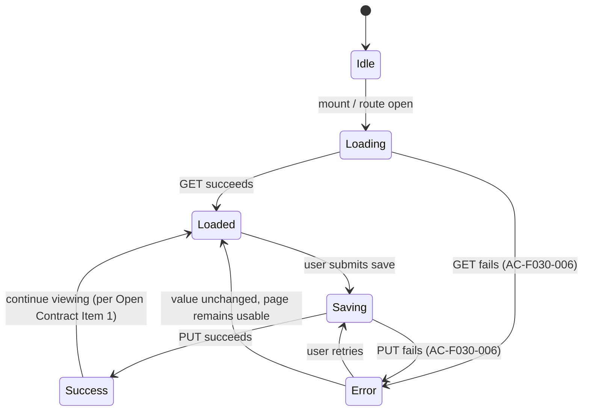

# F-030 — User Display Name — Technical Design

## 1. Metadata

| Field | Value |
|---|---|
| Feature ID | F-030 |
| Feature Title | User Display Name |
| Source Feature Specification | docs/project/features/F-030/feature-spec.md |
| Source Specification Status | Ready for Technical Planning |
| Source Specification Version | 1.0 |
| Technical Design Status | Ready for Engineering Review |
| Technical Design Version | 1.0 |
| Superseded Version | None |
| Owner | AGENT-103 — Technical Planner |
| Created | 2026-08-07 |
| Updated | 2026-08-07 |
| Next Intended Owner | AGENT-104 — Engineering Design Reviewer |

## Revision History

| Version | Date | Author | Changes | Resolved Return IDs |
|---|---|---|---|---|
| 1.0 | 2026-08-07 | AGENT-103 | Initial design | — |

## 2. Technical Overview

F-030 introduces a minimal, self-service profile surface. The backend extends the existing `users` Django app (the domain owner of the platform User identity) with a single new display-only attribute, `display_name`, on the `users.User` model, and two self-scoped endpoints — `GET /api/profile/` and `PUT /api/profile/` — that operate exclusively on the authenticated `request.user`. Because the endpoints never accept a target-user identifier, ownership enforcement is structural: no code path can read or modify another user's display name, and unauthenticated requests are rejected by DRF `IsAuthenticated` with `SessionAuthentication` (both already configured platform defaults under ADR-003).

The frontend gains a new profile page at `/profile` that displays the authenticated user's current display name and allows it to be updated, reached through a simple "Profile" link added to the existing home page (the only change to the home page, per BR-F030-004). The page implements the approved loading, success, and error states (FR-F030-006) using the existing `apiClient` (axios + CSRF header + 401 event dispatch).

The feature is intentionally isolated: no new Django app, no new datastore, no background processing, no change to authentication or credentials (BR-F030-003). Two contract details are deliberately deferred per the execution-milestone test contract and are recorded as explicit **Open Contract Items** in Section 11 — they must not be resolved in this design.

## 3. Source Contract and Traceability

### Approved Product Contract

The approved Feature Specification (F-030, v1.0) defines: a profile page at `/profile`; a "Profile" link on the existing home page; `GET /api/profile/` and `PUT /api/profile/` for the authenticated user's display name; ownership enforcement such that no user can view or modify another user's display name and unauthenticated users cannot access the capability; and loading/save/error states in the profile page. Display name is the only profile field; avatar, global navigation, other profile fields, and administrative display-name management are explicitly out of scope. All business rules, user stories, functional requirements, acceptance criteria, and engineering attention flags are preserved exactly as specified.

### Requirements-to-Design Traceability

| Requirement or Acceptance Criterion | Design Response | Design IDs or Sections |
|---|---|---|
| FR-F030-001 — Profile page at `/profile` | New profile page route rendered only for authenticated users | CMP-F030-002, §14 Flow 1 |
| FR-F030-002 — Home page "Profile" link | Link added to existing home page; no other home-page change | CMP-F030-003, TD-F030-005 |
| FR-F030-003 — Page displays current display name | `GET /api/profile/` returns the stored display name; page renders it | API-F030-001, CMP-F030-002 |
| FR-F030-004 — Submit new display name, persisted | `PUT /api/profile/` persists `display_name` on the current user | API-F030-002, DM-F030-001, TD-F030-004 |
| FR-F030-005 — Profile access restricted to the authenticated user | Self-scoped endpoints operating on `request.user` only; no target-user identifier exists | TD-F030-002, API-F030-001, API-F030-002, §17 |
| FR-F030-006 — Loading, success, and error states | ProfilePage state machine: Loading, Saving, Success, Error | CMP-F030-002, §14 |
| AC-F030-001 — `/profile` displays a profile page | ProfilePage route with authenticated guard | CMP-F030-002, §14 Flow 1 |
| AC-F030-002 — Home page contains a "Profile" link to `/profile` | Home page link navigates to `/profile` | CMP-F030-003 |
| AC-F030-003 — Stored display name shown on profile | GET contract returns the stored value; page renders it on load | API-F030-001, CMP-F030-002 |
| AC-F030-004 — New name persisted and shown with success indication | PUT persists; page reflects updated value and shows success indication (mechanism per Open Contract Item 1) | API-F030-002, CMP-F030-002, §14 Flow 2 |
| AC-F030-005 — Another user's profile cannot be accessed | Structural ownership — no path accepts a user identifier; only `request.user` is ever read or written | TD-F030-002, API-F030-001, API-F030-002, §20 ES-F030-004 |
| AC-F030-006 — Fetch/update failure shows error, stored value unchanged | Error state on failed GET/PUT; update is atomic and leaves stored value unchanged | CMP-F030-002, API-F030-002, §18, §20 ES-F030-006 |
| AC-F030-007 — Unauthenticated user cannot view or update | DRF `IsAuthenticated` + `SessionAuthentication`; 401 with no data returned | TD-F030-003, API-F030-001, API-F030-002, §20 ES-F030-003 |
| EAF-F030-001 — Ownership enforcement on profile data | Self-scoped endpoints; ownership by construction | TD-F030-002, §17 |
| EAF-F030-002 — Display name validation constraints | Recorded as Open Contract Item 2; not resolved in this design | §11 Open Contract Items |
| EAF-F030-003 — Display identity versus authentication identity | Separate `display_name` field; never read for sign-in or credentials | DM-F030-001, TD-F030-001, §17 |
| EAF-F030-004 — Loading, save, and error state behavior | Explicit page state machine; success indication only on confirmed save | CMP-F030-002, §14 Flow 2 |

## 4. Contract Boundary Declaration

### Contract Naming Convention

All contract names follow the pattern `<DOMAIN>-<FEATURE>-<SCOPE>` (e.g., `API-F030-PROFILE`, `DB-F030-PROFILE`, `RT-F030-PROFILE`).

### Contract Definitions

#### API Contract

- **Name:** API-F030-PROFILE
- **Version:** 1.0
- **Sections:** Section 11 (API Design) — API-F030-001 and API-F030-002 (GET and PUT `/api/profile/`); Section 14 (Runtime and Data Flows) — profile load and save flows; Section 18 (Failure, Degradation, and Recovery) — error behavior.
- **Consumers:** Frontend Implementation Agent, Backend Implementation Agent

#### Database Contract

- **Name:** DB-F030-PROFILE
- **Version:** 1.0
- **Sections:** Section 10 (Data Model Changes) — `users.User.display_name` text column; Section 20 (Migration and Backward Compatibility) — additive nullable column, no backfill.
- **Consumers:** Backend Implementation Agent

#### Runtime Contract

- **Name:** RT-F030-PROFILE
- **Version:** 1.0
- **Sections:** Section 5 (Architectural Context) — session authentication dependency on F-001; Section 14 (Runtime and Data Flows) — request/response flows and page state transitions.
- **Consumers:** Backend Implementation Agent, Frontend Implementation Agent

### Versioning Rules

A contract version changes only when its externally observable behavior or obligations change. Changes confined to wording, examples, formatting, or explanatory text do not require a version increment.

A contract represents a consumer-facing obligation, not a grouping of convenient sections. Section membership exists to identify where the obligation is defined; version changes are driven by semantic impact.

Contract versions are independent from the Technical Design document version. The two version sequences track different things: the document version tracks the evolution of the design document; contract versions track the evolution of specific declared obligations.

- **Version owner:** AGENT-103 — Technical Planner

## 5. Architectural Context

### Relevant Current Architecture

The platform is a modular monolith (ADR-002). Backend modules are Django apps organized by business capability; the `users` app owns the User model and identity. The API layer uses Django REST Framework (ADR-003) with platform defaults already configured in `config/settings/base.py`: `SessionAuthentication`, `IsAuthenticated`, `PageNumberPagination`, and DRF throttling. The frontend is a React + TypeScript + Material UI SPA with a shared `apiClient` (axios instance with `baseURL: /api/`, `withCredentials`, automatic `X-CSRFToken` header on mutating requests, and a `401 → auth:unauthorized` event dispatch).

### Binding ADRs

- **ADR-001 (Resource-Centric Domain):** No resource-model change. Profile identity is a user concern, orthogonal to Resources.
- **ADR-002 (Modular Monolith):** Profile logic lives inside the existing `users` Django app. No new service or microservice.
- **ADR-003 (Django REST Framework):** Profile endpoints use DRF views with the platform's configured authentication and permission classes, standardized error format, and OpenAPI schema registration.

### Existing Reusable Capabilities

| Capability | Where | Used For |
|---|---|---|
| `users.User` model (`AbstractUser`) | `platform/backend/users/models.py` | Hosts the new `display_name` attribute |
| DRF `SessionAuthentication` + `IsAuthenticated` | `config/settings/base.py` | Endpoint authentication and authorization defaults |
| Django CSRF middleware + frontend `apiClient` | `config/settings/base.py`, `platform/frontend/src/services/apiClient.ts` | CSRF-safe mutation for PUT |
| DRF throttling (anon 100/h, user 1000/h) | `config/settings/base.py` | Abuse control for the new endpoints |
| `apiClient` 401 event dispatch | `platform/frontend/src/services/apiClient.ts` | Unauthenticated handling in the profile page |
| Existing home page route (`/`) | `platform/frontend/src/App.tsx` | Target for the "Profile" link |

### Affected Boundaries

| Boundary | Impact |
|---|---|
| `users` app (backend) | Gains `display_name` field and profile endpoint views + URL route |
| `config/urls.py` | Gains a `api/profile/` route wired to `users` views |
| Frontend routing | Gains `/profile` route; home page gains one link |
| F-001 (User Authentication) | Dependency only — session establishment must exist for the profile endpoints to be reachable; F-001 is not modified |
| Other features | None — no existing capability or contract changes |

### Material Documentation/Implementation Discrepancies

| Discrepancy | Resolution |
|---|---|
| F-001 backend endpoints are not yet implemented (`platform/backend/users/urls.py` is empty) though the frontend `authService` assumes them | Recorded as INT-F030-001 and TR-F030-001. F-030 depends on F-001 session establishment (DEP-F030-001) and does not substitute for it |

## 6. Design Goals

1. **Minimal surface:** The smallest complete implementation of the approved contract — one model field, two self-scoped endpoints, one page, one link.
2. **Ownership by construction:** No URL or payload can reference another user; the authenticated user is the only subject the endpoints can read or write.
3. **Reuse over invention:** Use the existing `users` app, DRF defaults, `apiClient`, and session authentication. No new app, datastore, or background processing.
4. **Display-only identity:** `display_name` never influences sign-in, session validity, or credentials (BR-F030-003).
5. **Observable states:** The profile page always communicates loading, success, or error clearly (FR-F030-006).
6. **Explicit dependency:** The F-001 authentication dependency is documented and testable, not silently assumed.

## 7. Technical Constraints

| ID | Constraint |
|---|---|
| TC-F030-001 | Must operate within the approved modular monolith (ADR-002) and existing `users` domain ownership |
| TC-F030-002 | Must use DRF with the platform's configured authentication/permission defaults (ADR-003) |
| TC-F030-003 | Must not introduce a new Django app, datastore, background job, or external integration |
| TC-F030-004 | Must not alter authentication, session, or credential behavior (BR-F030-003) |
| TC-F030-005 | Must not add any profile field beyond `display_name` (scope) |
| TC-F030-006 | Must not change the home page beyond adding the "Profile" link (BR-F030-004) |
| TC-F030-007 | Must leave the PUT response contract and `display_name` validation constraints OPEN per the execution-milestone test contract (Section 11 Open Contract Items) |

## 8. Technical Decisions and Alternatives

### TD-F030-001 — Store `display_name` on the existing `users.User` model

**Context:** F-030 introduces a new per-user attribute. The domain model (component-design.md) assigns User and identity to the `users` module; the platform's User model already lives there.

**Selected approach:** Add a `display_name` text field to `users.User`. The `users` app owns the attribute, its lifecycle, and the profile endpoints that read and write it. No new Django app is created.

**Alternatives considered:**
- New `profile` Django app — rejected: it would own no independent business data beyond the User's own attribute, violating the Ownership Test; the profile is a view over the User identity, not a new domain.
- Store display name in a key-value metadata model (ADR-006 style) — rejected: the attribute is a first-class, single-value user identity attribute, not resource metadata; key-value storage would obscure the model and add query indirection for no benefit.

**Technical rationale:** The attribute belongs to the domain that owns the underlying identity (Configuration Ownership Test). Extending the existing model is the simplest maintainable approach and keeps F-030 isolated within one module boundary.

**Consequences:** One additive migration on `users_user`. The attribute is available to any future surface (e.g., displaying display names elsewhere) without a new module.

**Propagation:** Data Model (DM-F030-001), API (API-F030-001/002), Security (§17), Migration (§20).

### TD-F030-002 — Self-scoped profile endpoints (ownership by construction)

**Context:** BR-F030-001 and EAF-F030-001 require that only the authenticated user can view or update their own display name, and that another user's display name can never be returned or modified.

**Selected approach:** `GET /api/profile/` and `PUT /api/profile/` accept no user identifier — not in the path, query, or body. Every request resolves the subject as `request.user` from the authenticated session. There is therefore no object-level authorization decision to make: the only record reachable is the caller's own.

**Alternatives considered:**
- Parameterized endpoint such as `GET /api/users/{id}/profile/` with object-level permission checks — rejected: introduces a lookup surface, requires an object-level permission decision, and creates a route by which a caller could at least attempt to reach another user's record. The feature requires no cross-user access.
- `GET /api/users/me/` style — rejected: equivalent ownership semantics but a different URL contract than the approved `GET /api/profile/`.

**Technical rationale:** Structural enforcement is stronger and simpler than per-request checks. AC-F030-005 (attempts to access another user's profile must not succeed) is satisfied trivially because no such attempt can be expressed in the contract.

**Consequences:** The API contract is fixed at `/api/profile/`. No user enumeration or cross-user lookup surface exists. 403 is not an expected outcome for these endpoints (there is no authenticated-but-forbidden case); unauthenticated callers receive 401.

**Propagation:** API (API-F030-001/002), Security (§17), Scenarios (ES-F030-004), Risks (TR-F030-004).

### TD-F030-003 — Reuse DRF SessionAuthentication + IsAuthenticated

**Context:** DEP-F030-001 requires that only authenticated (identified) users access the profile capability. The platform already configures `SessionAuthentication` and `IsAuthenticated` as DRF defaults (ADR-003).

**Selected approach:** The profile endpoints declare the platform's existing session authentication and `IsAuthenticated` permission. No new authentication scheme, token model, or custom permission class is introduced.

**Alternatives considered:**
- Token authentication for the profile API — rejected: the platform has no token scheme (F-001 is session-based) and introducing one for a self-service page endpoint would change the platform's authentication posture.
- Custom ownership permission class — rejected: unnecessary under TD-F030-002 because the endpoints are self-scoped; a custom class would duplicate structural guarantees.

**Technical rationale:** F-001's session-based authentication is the established mechanism for authenticated users; DRF defaults are already configured. Reuse keeps the trust boundary unchanged.

**Consequences:** Profile requests carry the session cookie; mutating PUT requires a valid CSRF token (already handled by `apiClient`). The endpoints are unreachable until F-001 session establishment exists (INT-F030-001, TR-F030-001).

**Propagation:** API (API-F030-001/002), Security (§17), Integration (INT-F030-001), Scenarios (ES-F030-003).

### TD-F030-004 — PUT is a full-field replace of the current user's display name

**Context:** FR-F030-004 requires that the authenticated user can submit a new display name and that the platform persists it as their current display name. The approved contract names `PUT /api/profile/` for this.

**Selected approach:** `PUT /api/profile/` accepts a JSON body containing the `display_name` text value and replaces the current user's stored `display_name` with the submitted value. PUT semantics are idempotent: submitting the same value repeatedly converges to the same stored state. The update is a single atomic write on the user's row.

**Alternatives considered:**
- PATCH semantics (partial field update) — rejected: the profile has exactly one editable field; full-field replace with PUT matches the approved contract and is simpler.
- Dedicated action endpoint (`POST /api/profile/update-display-name/`) — rejected: diverges from the approved `PUT /api/profile/` contract.

**Technical rationale:** Full-field replace is the natural PUT semantic, is idempotent (safe to retry), and leaves no ambiguity about which fields are updated.

**Consequences:** On failure, no partial update occurs and the stored value is unchanged (AC-F030-006). The success response contract is deliberately not specified here (Open Contract Item 1).

**Propagation:** API (API-F030-002), Data Flow (§14 Flow 2), Failure (§18), Scenarios (ES-F030-002, ES-F030-006).

### TD-F030-005 — Frontend profile page with explicit state machine and home-page link

**Context:** FR-F030-001, FR-F030-002, and FR-F030-006 define the profile page, the home-page link, and the loading/save/error states. The frontend is a React SPA with an existing `apiClient`.

**Selected approach:** A new profile page component at route `/profile` manages a small local state machine (Idle → Loading → Loaded/Error; Saving → Success/Error) using `apiClient` calls. The home page (`/`) gains a single "Profile" link to `/profile`. State remains local to the page; no global store is introduced for a single-field profile.

**Alternatives considered:**
- Global state store (zustand/react-query) for profile data — rejected: the profile is a single page with one field; a global store adds coupling and complexity without satisfying a requirement.
- Server-rendered template page — rejected: the platform is a React SPA with DRF JSON APIs (ADR-003).

**Technical rationale:** Local component state mirrors the existing `SystemInfo` pattern in the bootstrapped frontend and is sufficient for fetch/update/error handling on one field.

**Consequences:** The page depends on `GET /api/profile/` on mount and `PUT /api/profile/` on save. The detailed component structure is owned by the Frontend Integration Planner; this design fixes the logical boundaries and contracts only.

**Propagation:** Components (CMP-F030-002/003), Data Flow (§14), Scenarios (ES-F030-001, ES-F030-005, ES-F030-006).

## 9. Component Design

### CMP-F030-001 — Profile API (Backend, `users` app)

**Type:** Extended (existing `users` Django app)

**Responsibility:** Serve the self-scoped profile contract: read the authenticated user's `display_name` (GET) and replace it (PUT). Resolve the subject exclusively from `request.user`; enforce session authentication and `IsAuthenticated` (TD-F030-003).

**Inputs and outputs:**
- Input: `GET /api/profile/` and `PUT /api/profile/` requests with a valid session (and CSRF token for PUT).
- Output: GET returns the stored `display_name`; PUT persists the submitted value and returns the (deliberately unspecified) response per Open Contract Item 1.

**State and data ownership:** Owns the `display_name` field on `users.User` (DM-F030-001). No other persistent state.

**Dependencies:** DRF (`SessionAuthentication`, `IsAuthenticated`), Django ORM (User model), F-001 session framework (existing).

**Failure boundary:** All failures are contained in the view layer: unauthenticated → 401 (no data returned); validation/update failures → platform error format; the stored value is never partially modified. No cascading effect on other modules.

**Reuse rationale:** The `users` app already owns the User model; adding profile views is the natural module boundary. No new module is justified (Ownership Test, TD-F030-001).

**Domain ownership:** Extends the existing identity domain. It does not coordinate other domains and does not warrant a new module.

### CMP-F030-002 — ProfilePage (Frontend)

**Type:** New logical component (route at `/profile`)

**Responsibility:** Display the authenticated user's current display name, allow editing it, and communicate loading, success, and error states per FR-F030-006. On mount, fetch the current value via `GET /api/profile/`. On save, submit the new value via `PUT /api/profile/`; show a success indication when the save succeeds and an error indication (with the previously stored value unchanged) when it fails.

**Inputs and outputs:**
- Input: current value from GET; user's submitted display name.
- Output: PUT request on save; rendered states (Loading / Loaded / Saving / Success / Error) and the current display name.

**State and data ownership:** Owns its local UI state machine (Idle → Loading → Loaded/Saving → Success/Error). Does not own persistent data.

**Dependencies:** `apiClient` (session cookie, CSRF header, 401 event dispatch); router for `/profile`; the existing auth flow for unauthenticated redirect.

**Failure boundary:** All failures are isolated to the page: GET failure → Error state with the stored value not shown (per AC-F030-006); PUT failure → Error state, stored value unchanged; 401 → existing `auth:unauthorized` event drives the F-001 redirect flow.

**Reuse rationale:** New component — no existing profile page exists. It reuses the platform's API client rather than introducing a new data-access layer.

### CMP-F030-003 — Home Page Profile Link (Frontend)

**Type:** Extended (existing home page component)

**Responsibility:** Add a single visible "Profile" link on the existing home page that navigates to `/profile` (FR-F030-002, AC-F030-002). The home page gains no other behavior (BR-F030-004).

**Inputs and outputs:** Input: none beyond existing home page context. Output: navigation to `/profile`.

**State and data ownership:** None.

**Dependencies:** Router; existing home page surface (DEP-F030-002).

**Failure boundary:** Static link — no runtime failure mode beyond routing.

**Reuse rationale:** Extends the existing home page surface in place; no new shell or navigation component is introduced.

## 10. Data Model Changes

### DM-F030-001 — `users.User.display_name`

**Type:** New field on the existing `users.User` model (no new table).

**Entity:** `User`

| Field | Type | Nullable | Default | Description |
|---|---|---|---|---|
| display_name | TextField (text column) | Yes | None | The user's display-only name; separate from `username` and credentials (BR-F030-003, EAF-F030-003) |

**Invariants and validation:**
- The field is a text field. **Validation constraints — maximum length, character restrictions, and whether an empty display name is permitted — are Open Contract Item 2 and are intentionally NOT specified here.**
- No uniqueness requirement applies (per Feature Specification §9); two users may share a display name.

**Relationships and lifecycle:**
- Field on the User entity; no new relationships.
- Tied to the user record lifecycle. There is no separate retention or deletion policy; the value is removed with the user record.

**Indexes and query implications:**
- None. All access is by user primary key via the authenticated session (`request.user`); no lookup by `display_name` is required by any requirement.

**Retention, deletion, and audit implications:**
- The value is personal data (Feature Specification §16). It is only ever exposed to its owner through the self-scoped endpoints (§17).
- Update events are logged for auditability (§19) without logging the value itself.

**Migration and backfill constraints:**
- Additive migration: add the nullable text column to `users_user`.
- **No backfill** — existing rows are left with an unset value; no default display-name policy is defined (consistent with Open Contract Item 2).
- The column is nullable at the storage layer so users who have never set a display name have a valid state. Whether the API accepts a submitted empty value is a separate validation policy that remains OPEN.

**Configuration ownership:** No configuration data is introduced. The attribute is user data owned by the `users` domain; no new configuration model is warranted.

## 11. API Design

### API-F030-001 — GET /api/profile/

**Purpose:** Return the authenticated user's current display name (FR-F030-003).

**Consumers:** ProfilePage (CMP-F030-002).

**Authentication required:** Yes — DRF `SessionAuthentication` + `IsAuthenticated` (TD-F030-003).

**Authorization:** Self-scoped — the response is derived from `request.user` only; no user identifier is accepted (TD-F030-002).

**Request:** No path parameters, no query parameters, no body.

**Success response (200):**
```json
{
  "display_name": "<stored display name value>"
}
```
The value is the stored `display_name` for the authenticated user. For a user who has never saved a display name, the value is the unset stored state.

**Error responses:**
- 401: `{"detail": "Authentication credentials were not provided."}` — unauthenticated; no user data is returned (AC-F030-007).

**Pagination, filtering, ordering, and limits:** Not applicable — single-record self-scoped resource.

**Idempotency and concurrency:** GET is idempotent.

**Error contract:** Platform DRF error format; 401 per session-auth failure.

**Compatibility and versioning:** New endpoint; no backward-compatibility concern. Registered in the OpenAPI schema via the platform's drf-spectacular configuration.

### API-F030-002 — PUT /api/profile/

**Purpose:** Replace the authenticated user's `display_name` with the submitted value (FR-F030-004).

**Consumers:** ProfilePage (CMP-F030-002).

**Authentication required:** Yes — DRF `SessionAuthentication` + `IsAuthenticated` (TD-F030-003); CSRF token required (mutating request), supplied by `apiClient`.

**Authorization:** Self-scoped — updates `request.user` only; no user identifier is accepted (TD-F030-002).

**Request body:**
```json
{
  "display_name": "<text value>"
}
```
- `display_name` is a text value. **Validation constraints — maximum length, character restrictions, and whether an empty display name is permitted — are Open Contract Item 2 and are intentionally NOT specified here.**

**Behavior:** Persists the submitted value as the user's current `display_name` in a single atomic write on the user's row (TD-F030-004). A successful save is immediately reflected as the current display name (BR-F030-002). On any failure, the previously stored value remains unchanged (AC-F030-006).

**Success response:** **OPEN — deliberately deferred (Open Contract Item 1).** This design does not specify the success status code, the response body, or whether the client should refetch after a save.

**Error responses:**
- 401: `{"detail": "Authentication credentials were not provided."}` — unauthenticated (AC-F030-007).
- Validation errors (if the submitted value fails validation): platform error format per the open validation contract (Open Contract Item 2).
- 5xx: platform error format on server/database failure.

**Pagination, filtering, ordering, and limits:** Not applicable.

**Idempotency and concurrency:** PUT is idempotent (TD-F030-004) — repeated submission of the same value converges to the same stored state; a retry after a transient failure is safe. Concurrent PUTs are last-write-wins on the user's row (ES-F030-007).

**Error contract:** Platform DRF error format.

**Compatibility and versioning:** New endpoint; no backward-compatibility concern.

### Open Contract Items (deliberately deferred — controlled execution test)

The following two details are intentionally deferred by the execution-milestone test contract. They are NOT resolved in this design, are NOT defaults, and are NOT filled in by any engineering scenario. The implementation agent must escalate both as **NEEDS CLARIFICATION** rather than invent a default:

1. **PUT /api/profile/ response contract:** The response body, the success status code, and whether the client should refetch after a save are unspecified. The endpoint path and its behavior (update the current user's display name) are defined above.
2. **display_name maximum length / validation constraints:** Maximum length, character restrictions, and whether an empty display name is permitted are unspecified. The field is defined as a text field.

These items are product-contract ambiguities intentionally left open for the implementation agent to surface; they are not engineering assumptions, not Open Technical Questions, and do not block engineering review of the remaining design.

## 12. Integration Points

### INT-F030-001 — F-001 (User Authentication) Dependency

**Systems involved:** F-001 session framework (Django `django.contrib.sessions` + DRF `SessionAuthentication`) → `users` app profile views → frontend `apiClient`.

**Contract and ownership:** F-030 depends on F-001 session establishment (DEP-F030-001). Profile endpoints require a valid authenticated session cookie. F-001 owns login/session creation; F-030 consumes it. F-030 makes no change to F-001.

**Direction and timing:** Synchronous — every GET/PUT profile request is authenticated by the session middleware before the view runs.

**Consistency expectations:** Strong — a session present at request time resolves to exactly one `request.user`; no stale identity can be read.

**Timeout, retry, and idempotency:** Platform HTTP/session behavior; GET and PUT are idempotent per §11.

**Failure isolation:** If F-001 session endpoints are not yet available (current codebase state: `users/urls.py` is empty), all profile requests return 401 — the profile capability is unusable but nothing else is affected (TR-F030-001).

**Compatibility:** No contract change to F-001. `users.User` gains a field; F-001's serializers are unaffected.

### INT-F030-002 — Frontend Profile Contract

**Systems involved:** ProfilePage → `apiClient` → `/api/profile/`.

**Contract and ownership:** `apiClient` is the single HTTP access path (base URL `/api/`, `withCredentials`, CSRF header on mutating requests, 401 event dispatch). ProfilePage consumes the API-F030-PROFILE contract.

**Direction and timing:** Synchronous requests; GET on mount, PUT on save.

**Consistency expectations:** The page reflects the stored value after a successful load; after a successful save, the updated value and success indication are shown per Open Contract Item 1.

**Timeout, retry, and idempotency:** Axios default behavior; PUT retry is safe because PUT is idempotent (§11).

**Failure isolation:** API failure degrades to the page Error state only (§18).

**Compatibility:** New endpoints; `apiClient` needs no change.

## 13. Storage Strategy

**Storage class and ownership:** PostgreSQL, existing `users_user` table. The `users` app owns the new `display_name` column. No new storage class, bucket, or datastore.

**Expected data lifecycle:** Value lives with the user record; updated on each successful PUT; no separate lifecycle.

**Capacity implications:** One text value per user — negligible. No new capacity planning is warranted.

**Access patterns:** Point reads/writes by primary key from the authenticated session. No range scans, no lookups by value.

**Integrity:** Standard row-level atomicity; PUT writes the column in one update.

**Retention and deletion:** No separate retention policy; the value is removed with the user record.

**Backup and recovery:** Covered by the existing PostgreSQL backup strategy. No new storage concern.

## 14. Runtime and Data Flows

### Flow 1 — Profile page load (view current display name)

```mermaid
sequenceDiagram
    participant U as Authenticated User
    participant FE as React Frontend
    participant PS as ProfilePage / apiClient
    participant BE as Django Backend (users app)
    participant DB as PostgreSQL

    U->>FE: Navigate to /profile (via home "Profile" link)
    FE->>PS: ProfilePage mounts (state = Loading)
    PS->>BE: GET /api/profile/ (session cookie)
    Note over BE: SessionAuthentication validates session; IsAuthenticated
    BE->>DB: SELECT display_name FROM users_user WHERE id = request.user.id
    DB-->>BE: stored display_name
    BE-->>PS: 200 {"display_name": ...}
    PS-->>FE: response data
    FE->>FE: state = Loaded; render current display_name
```

### Flow 2 — Update display name

```mermaid
sequenceDiagram
    participant U as Authenticated User
    participant FE as React Frontend
    participant PS as ProfilePage / apiClient
    participant BE as Django Backend (users app)
    participant DB as PostgreSQL

    U->>FE: Edit display name; submit save
    FE->>FE: state = Saving
    FE->>PS: PUT /api/profile/ {"display_name": ...} (+ X-CSRFToken)
    PS->>BE: PUT /api/profile/
    Note over BE: SessionAuthentication + IsAuthenticated; CSRF validated
    BE->>BE: Validate display_name per Open Contract Item 2
    BE->>DB: UPDATE users_user SET display_name = ... WHERE id = request.user.id
    DB-->>BE: row updated
    Note over BE: Success response contract OPEN (Open Contract Item 1)
    BE-->>PS: Save outcome
    PS-->>FE: outcome
    FE->>FE: Success: success indication; updated value reflected<br/>(mechanism per Open Contract Item 1)
    Note over FE: Failure path: state = Error; stored value unchanged (AC-F030-006)
```

### Flow 3 — Unauthenticated access attempt



### Profile page state transitions



## 15. Performance Strategy

**Critical paths:**
1. Profile load: one indexed PK read (`SELECT ... WHERE id = request.user.id`) + session validation. Expected latency: <20ms.
2. Profile save: one row update by PK. Expected latency: <20ms.

**Expected data volumes:** One row per authenticated user; trivial at platform scale (<10K users, single organization).

**Latency or throughput constraints:** None specific to F-030. No product performance target is defined.

**Query and transfer bounds:** Single-record responses; response size is bounded by the text value. No pagination.

**Memory, CPU, and I/O pressure:** Negligible — no aggregation, no background work, no unbounded query.

**Caching or precomputation:** None required. The value is read on demand from the user's row.

**Protection against unbounded work:** DRF throttling applies (anon 100/h, user 1000/h); the endpoints process exactly one record per request. No unbounded work exists in the design.

## 16. Scalability Strategy

**Users:** The `users_user` table scales with the platform's existing user model. The added text column has no index and adds negligible storage per row.

**Requests:** The profile endpoints are single-row, point-access operations. They are not a scaling concern; DRF throttling bounds abuse.

**Datasets / geospatial size / complexity:** Not applicable — F-030 does not touch resource data, spatial data, or background processing.

**Background workload:** None introduced.

**Storage:** PostgreSQL; no new storage class (see §13).

**External integrations:** None introduced; only the existing F-001 session mechanism and the frontend SPA.

**Practical scaling boundaries:** The endpoints inherit the platform's session/database scaling characteristics. No feature-specific boundary exists below the platform-wide limit.

## 17. Security and Privacy

**Authentication:** DRF `SessionAuthentication` (F-001 session framework) for both endpoints. Unauthenticated requests are rejected with 401 and receive no user data (AC-F030-007). No new authentication scheme is introduced (TD-F030-003).

**Authorization:** `IsAuthenticated` plus structural self-scoping (TD-F030-002). There is no user identifier anywhere in the contract, so no cross-user access is expressible (BR-F030-001, AC-F030-005). 403 does not apply — no authenticated-but-forbidden case exists.

**Object-level and tenant-level isolation:** The profile endpoints operate only on `request.user`. No object-level permission model (F-007) is needed for this feature.

**Input validation:** Request bodies are parsed by the DRF serializer layer. `display_name` is a text value; validation limits are Open Contract Item 2. Malformed payloads (missing field, wrong type, non-JSON) are rejected with platform validation errors and never touch storage.

**Data exposure:** The display name is personal data (Feature Specification §16) and is exposed only to its owner through the self-scoped GET. It is never returned in any other endpoint, never returned in list/collection form, and is never used for authentication or credentials (BR-F030-003, EAF-F030-003).

**Secrets and credentials:** None introduced.

**Auditability:** Profile GET/PUT outcomes and failures are logged (see §19). Update events are attributable to the authenticated user via the session. Logs do not record display-name values.

**Abuse controls:** Existing DRF throttling (anon 100/h, user 1000/h). No additional rate limiting is warranted for a single-field self-service resource.

**Privacy and retention:** Display name retention is tied to the user record (§13). No new data collection beyond the approved attribute.

## 18. Failure, Degradation, and Recovery

**Expected failure modes:**
1. Unauthenticated request (no/expired session) → 401, no data returned.
2. GET/PUT database failure → 5xx platform error.
3. PUT validation failure → platform validation error; stored value unchanged.
4. Frontend network failure on GET/PUT → page Error state.
5. F-001 session endpoints unavailable → all profile requests 401 (INT-F030-001).

**Containment boundaries:** All failures are contained in the profile view and the profile page. No other module or surface is affected. The home page link remains functional (it is a static route).

**Timeout and retry policy:** Platform HTTP/axios defaults. No custom timeouts needed for single-row operations.

**Idempotency:** GET is idempotent. PUT is idempotent (TD-F030-004), so retrying a failed save is safe and converges to the submitted value.

**Partial failure behavior:** The update is a single atomic row write — there is no partial-update state. Either the stored value is replaced or it is unchanged.

**Safe degradation:** If the profile API is unavailable, the profile page shows an Error state and remains usable for retry; the rest of the platform is unaffected.

**Restart and recovery:** No process state is held server-side beyond the session; page reloads re-fetch from storage. Recovery after a database failure is automatic once the database returns.

**Rollback considerations:** §20 defines migration rollback. No runtime rollback beyond the idempotent PUT semantics.

**Data reconciliation:** Not applicable — a single authoritative row is read on every request; no derived or cached state exists.

## 19. Observability

**Structured logs:**
- Profile GET outcome (authenticated success, 401) with `user_id` and duration.
- Profile PUT outcome (success, validation failure, server failure) with `user_id` — **without** the display-name value.
- Unexpected 5xx with error context.

**Metrics:**
- `profile.api.requests_total` — counter by endpoint (GET/PUT) and status class.
- `profile.api.duration_ms` — histogram (optional at this scale).

**Traces:** Not applicable beyond the platform's existing request logging — single synchronous DB operation.

**Audit events:** Profile display name updated (`user_id`, timestamp, `event="profile_display_name_updated"`). Value not logged.

**Health or readiness signals:** No new health endpoint. The existing platform health surface covers the backend; profile availability is implied by session + database health.

**Alert conditions:**
- Elevated 5xx rate on `/api/profile/` (database or session degradation).
- Elevated 401 rate without corresponding session creation (misconfiguration or abuse).

**Correlation identifiers:** Platform request IDs as provided by the existing logging setup.

## 20. Migration and Backward Compatibility

**Schema and data migration:**
- One additive migration: add `users_user.display_name` as a nullable text column (DM-F030-001).
- No new tables; no destructive change.

**Backfill:**
- None required. The column is nullable; existing rows are left unset (no default display-name policy is defined, consistent with Open Contract Item 2).

**Deployment compatibility:**
- Schema-before-code is safe here: adding a nullable column does not break existing code, and the new endpoint code only becomes reachable when its route is registered.
- New URL route `api/profile/` added to the project URL configuration; existing routes unchanged.
- Frontend: new `/profile` route and home link are additive; existing home page content remains.

**API or event compatibility:**
- Both endpoints are new; no existing consumer is affected.
- No events or messages introduced.

**Mixed-version operation:**
- During rollout, old frontend builds without the profile link/page are unaffected; the new endpoints are inert until used.
- The new nullable column is ignored by existing code paths.

**Rollback safety:**
- Reverse migration drops the `display_name` column.
- Removing the route and frontend page restores the previous behavior; the home page loses only the added link.

**Historical data:**
- No historical data concern — display names are current-state values; there is no versioning requirement.

## 21. Engineering Scenarios

### ES-F030-001 — Normal profile load and view

**Scenario class:** Normal

**Trigger and scale:** Authenticated user with a stored display name opens `/profile` from the home page link.

**Approved behavior preserved:** FR-F030-001, FR-F030-002, FR-F030-003, AC-F030-001, AC-F030-002, AC-F030-003.

**Architectural concern:** The page loads the correct stored value and renders it with a Loading → Loaded transition.

**Design response:** GET `/api/profile/` resolves `request.user` from the session, reads the row by PK, returns `display_name`; the page renders it after the Loaded transition (Flow 1, §14).

**Failure behavior:** GET failure → Error state (AC-F030-006); no stale or partial value shown.

**Recovery:** User retries; the page re-fetches on retry.

**Observability:** GET outcome logged with `user_id`.

**Later validation concern:** Verify the stored value equals what is rendered and that the home page link navigates to `/profile`.

### ES-F030-002 — Normal display name update

**Scenario class:** Normal

**Trigger and scale:** Authenticated user submits a new display name and the PUT succeeds.

**Approved behavior preserved:** FR-F030-004, BR-F030-002, AC-F030-004.

**Architectural concern:** The update persists atomically and the page reflects it with a success indication.

**Design response:** PUT `/api/profile/` validates the submitted text (per Open Contract Item 2), updates the user's row, and the page transitions Saving → Success and reflects the updated value. How the updated value is obtained/reflected (response payload, refetch, or local state) is deliberately not specified (Open Contract Item 1).

**Failure behavior:** Any failure leaves the stored value unchanged and shows an Error state (AC-F030-006).

**Recovery:** PUT is idempotent; retry is safe (TD-F030-004).

**Observability:** PUT outcome logged with `user_id`, no value logged.

**Later validation concern:** Verify a successful save is reflected as the user's current display name (BR-F030-002) and that a success indication is presented per the resolved response contract.

### ES-F030-003 — Unauthenticated access is rejected

**Scenario class:** Permission

**Trigger and scale:** Unauthenticated user (no session) opens `/profile` or calls the endpoints directly.

**Approved behavior preserved:** BR-F030-001, AC-F030-007.

**Architectural concern:** No display name data may be returned to an unauthenticated caller.

**Design response:** DRF `IsAuthenticated` + `SessionAuthentication` returns 401 with no user data (Flow 3, §14); the frontend `auth:unauthorized` event routes to the F-001 login flow.

**Failure behavior:** 401; no data leakage.

**Recovery:** User authenticates via F-001 and returns to the profile.

**Observability:** 401 logged per platform convention.

**Later validation concern:** Verify both GET and PUT return 401 with no data for anonymous callers.

### ES-F030-004 — Another user's profile cannot be accessed

**Scenario class:** Permission

**Trigger and scale:** Authenticated user attempts to read or modify another user's display name (e.g., by guessing URLs or IDs).

**Approved behavior preserved:** BR-F030-001, AC-F030-005.

**Architectural concern:** The contract must be structurally incapable of cross-user access.

**Design response:** The endpoints accept no user identifier (TD-F030-002). There is no URL, query, or body path by which another user's record can be addressed; only `request.user` is ever read or written.

**Failure behavior:** Any such attempt fails at the contract level (no valid request form exists).

**Recovery:** Not applicable — no cross-user state is reachable.

**Observability:** No distinct signal expected; the 404/405 platform handling applies to non-existent routes.

**Later validation concern:** Verify that no request form to `/api/profile/` can return or modify another user's display name.

### ES-F030-005 — User without a stored display name opens profile

**Scenario class:** Boundary

**Trigger and scale:** Authenticated user who has never saved a display name opens `/profile`.

**Approved behavior preserved:** FR-F030-003 — the page displays the user's current display name state.

**Architectural concern:** The unset state must load without error and render without crashing.

**Design response:** GET returns the stored (unset) value; the page renders the unset state. Whether an empty display name is a permitted saved value is Open Contract Item 2 and is not resolved here.

**Failure behavior:** The page must not error on an unset value.

**Recovery:** The user can save a value via the save flow.

**Observability:** Normal GET outcome logged.

**Later validation concern:** Verify the unset state renders cleanly and that saving from this state behaves consistently with the resolved validation contract.

### ES-F030-006 — Update fails; stored value unchanged

**Scenario class:** Network / Recovery

**Trigger and scale:** PUT fails (network drop, database error, validation rejection) after the user submits a new value.

**Approved behavior preserved:** AC-F030-006 — error indication shown and the previously stored display name remains unchanged.

**Architectural concern:** Failure must not partially apply the update or mislead the user into believing the save succeeded.

**Design response:** The update is a single atomic row write (§18); any failure occurs before or within that write with no partial state. The page transitions to Error and keeps the last loaded value; success indication is only shown on a confirmed save (FR-F030-006).

**Failure behavior:** Error state; stored value unchanged.

**Recovery:** PUT is idempotent; the user can retry safely (TD-F030-004).

**Observability:** PUT failure logged with outcome and error context.

**Later validation concern:** Verify that a failed save leaves the stored value byte-for-byte unchanged and that no success indication is shown.

### ES-F030-007 — Concurrent saves from the same user

**Scenario class:** Concurrency

**Trigger and scale:** Two PUT requests for the same user arrive nearly simultaneously (double-click, retry plus new edit).

**Approved behavior preserved:** FR-F030-004; the persisted value is one of the submitted values and BR-F030-002 holds.

**Architectural concern:** Row-level write integrity and idempotency under concurrent updates.

**Design response:** Each PUT is an independent atomic UPDATE on the user's row; PostgreSQL row locking serializes them; the final stored value is the last committed write (last-write-wins). No read-modify-write sequence is involved.

**Failure behavior:** No torn or partially written value can occur.

**Recovery:** The user sees the state after both writes resolve; a re-save corrects any surprise.

**Observability:** Both PUT outcomes logged.

**Later validation concern:** Verify no lost-update anomaly beyond last-write-wins and no error under concurrent identical PUTs.

### ES-F030-008 — Malformed or abusive input

**Scenario class:** Abuse

**Trigger and scale:** Caller submits non-JSON bodies, missing `display_name`, wrong types (e.g., object/array), extremely long strings, or repeated requests.

**Approved behavior preserved:** No data corruption, no platform failure, no unbounded resource use.

**Architectural concern:** Serializer-layer validation and throttling must contain abuse.

**Design response:** DRF serializer rejects malformed payloads with platform validation errors before any storage write; DRF throttling bounds request rates; `display_name` is stored as text and rendered via React escaping (no HTML interpretation). Specific validation limits remain Open Contract Item 2.

**Failure behavior:** 400-class validation errors; no storage mutation.

**Recovery:** Legitimate requests continue after throttling windows.

**Observability:** Validation failures and throttling events logged.

**Later validation concern:** Verify malformed payloads are rejected without side effects and that repeated abuse is throttled.

### ES-F030-009 — Database dependency failure

**Scenario class:** Dependency / Recovery

**Trigger and scale:** PostgreSQL is unavailable or slow when a profile request arrives.

**Approved behavior preserved:** AC-F030-006 — the page shows an error indication; no incorrect value or false success.

**Architectural concern:** Read/write failures must surface cleanly and not hang the page indefinitely.

**Design response:** The database error propagates to a 5xx platform response; the page transitions to Error with the stored value unchanged; the idempotent PUT makes retry safe after recovery.

**Failure behavior:** 5xx; page Error state; no data loss.

**Recovery:** Automatic once the database returns; retry re-reads current storage.

**Observability:** 5xx rate on `/api/profile/` is an alert condition (§19).

**Later validation concern:** Verify graceful error handling under database outage and correct recovery.

### ES-F030-010 — Scale: many users with profiles

**Scenario class:** Scale

**Trigger and scale:** Platform at expected scale (single organization, <10K users) with all users holding display names; concurrent profile loads.

**Approved behavior preserved:** All F-030 requirements, unchanged.

**Architectural concern:** The added column and endpoints must not introduce per-request overhead or contention.

**Design response:** Point reads/writes by PK on an existing table; no new index, no scan, no background work; throttling bounds request rates.

**Failure behavior:** Degrades only with the platform's overall database/session capacity.

**Recovery:** Standard platform recovery.

**Observability:** Existing platform metrics.

**Later validation concern:** Verify no material latency regression on profile load/save at expected concurrency.

## 22. Technical Risks

### TR-F030-001 — F-001 session authentication not yet available

**Risk condition:** F-001 backend endpoints are not implemented (current codebase: `users/urls.py` empty), so no API session can be established when F-030 ships.

**Architectural impact:** All profile requests return 401; the feature is not user-testable until F-001 delivers session login (DEP-F030-001).

**Trigger or early warning:** Absence of a working login/session endpoint at F-030 integration time.

**Prevention or mitigation:** F-030 is intentionally isolated and declares the dependency explicitly (INT-F030-001). No profile code depends on F-001 internals beyond DRF `SessionAuthentication`, which is already configured.

**Fallback or recovery:** F-001 completion activates session establishment; F-030 requires no code change.

**Residual concern:** Sequencing risk between F-001 and F-030 execution.

**Review discipline:** Senior Developer (integration sequencing verification).

### TR-F030-002 — Open PUT response contract causes frontend/backend divergence

**Risk condition:** The PUT success response contract is deliberately open (Open Contract Item 1); an implementation agent could silently invent a default, or the frontend and backend could assume different contracts.

**Architectural impact:** A mismatched client/server contract breaks the save flow or produces a misleading success indication (violating FR-F030-006).

**Trigger or early warning:** Implementation proceeds without escalating the open item.

**Prevention or mitigation:** The open item is explicitly recorded in §11 with an instruction to escalate as NEEDS CLARIFICATION; AC-F030-004/006 are preserved regardless of the eventual response contract because failure never changes storage and success reflects the submitted value.

**Fallback or recovery:** Resolve the contract with the product owner before implementation proceeds; revise this design only if the resolution changes architecture (version bump via normal pipeline).

**Residual concern:** Coordination effort at implementation time.

**Review discipline:** QA (save-flow validation), Senior Developer.

### TR-F030-003 — Open validation contract yields inconsistent client/server validation

**Risk condition:** `display_name` validation limits are deliberately open (Open Contract Item 2); implementation could add limits on one side only, or treat the open item as resolved.

**Architectural impact:** Users may receive inconsistent feedback between the page and the API, or a stored value that later surfaces as invalid.

**Trigger or early warning:** Client-side validation rules that differ from server behavior.

**Prevention or mitigation:** The open item is recorded in §11; the design specifies the field as text and requires the implementation agent to escalate rather than invent limits; any eventual validation is enforced server-side (the serializer is authoritative).

**Fallback or recovery:** Align client and server validation to the resolved contract; stored values are plain text and require no data migration to add limits.

**Residual concern:** The eventual validation policy is a product decision outside this design.

**Review discipline:** QA (validation behavior), Security Reviewer (input bounds).

### TR-F030-004 — Display name personal-data exposure

**Risk condition:** `display_name` is personal data (Feature Specification §16). If a future surface renders or returns it without ownership checks, it could leak.

**Architectural impact:** Privacy exposure and potential violation of BR-F030-001.

**Trigger or early warning:** New endpoints or surfaces reading `display_name` without the self-scoped pattern.

**Prevention or mitigation:** This design exposes the value only through self-scoped endpoints (TD-F030-002); logs never record the value (§19); React escaping prevents HTML interpretation.

**Fallback or recovery:** Any new surface must follow the same ownership-by-construction pattern; review gates cover new usage.

**Residual concern:** The value's display in other surfaces is out of scope for F-030 (Feature Specification §10) and must be re-evaluated when introduced.

**Review discipline:** Security Reviewer.

### TR-F030-005 — CSRF handling regression on PUT

**Risk condition:** If the frontend fails to attach the `X-CSRFToken` header or CSRF cookie handling breaks, all PUT requests fail with 403.

**Architectural impact:** The save flow breaks; users cannot update their display name.

**Trigger or early warning:** 403 responses on `/api/profile/` PUT in integration testing.

**Prevention or mitigation:** Reuse the existing `apiClient` interceptor that attaches the CSRF token on mutating requests (validated in `platform/frontend/src/services/apiClient.ts`); no new transport layer is introduced.

**Fallback or recovery:** Verify CSRF cookie availability and interceptor behavior; platform CSRF configuration is unchanged.

**Residual concern:** Low — the mechanism is already proven by the bootstrapped client.

**Review discipline:** Senior Developer, Security Reviewer.

## 23. Required ADRs

### None

All design decisions in this document are feature-local:
- Extending the existing `users` app with one attribute and two endpoints follows ADR-002 (modular monolith) and the domain ownership in component-design.md.
- The API layer follows ADR-003 (DRF) with already-configured platform defaults.
- No decision establishes or changes a platform-wide technical convention, affects cross-feature contracts, modifies an approved ADR, changes a system/trust boundary, or introduces a strategic platform technology.

No new ADR is required.

## 24. Engineering Assumptions

### EA-F030-001 — F-001 session authentication is available at F-030 delivery

**Assumption:** Django session authentication (F-001) is functional — a login/session endpoint exists or is delivered in the same execution milestone — so an authenticated session can be established for profile requests.

**Evidence:** DEP-F030-001 declares F-001 as the authentication dependency; DRF `SessionAuthentication` is already configured; the frontend already contains F-001 service stubs.

**Validation:** Integration test that logs in, then calls GET and PUT `/api/profile/` with the session cookie.

**Design affected if false:** Profile endpoints remain 401 until F-001 completes (TR-F030-001). No F-030 code changes are required; only sequencing.

### EA-F030-002 — Home page is the existing bootstrapped React surface at `/`

**Assumption:** The platform's home page at route `/` is the surface where the "Profile" link is added.

**Evidence:** BR-F030-004 (home page gains only a link); DEP-F030-002 (existing home page surface); validated `App.tsx` defines `/`.

**Validation:** Frontend Integration Planner and implementation confirm the route exists unchanged.

**Design affected if false:** The link target placement changes but the contract (link navigates to `/profile`) is unchanged.

### EA-F030-003 — Existing user rows may exist; no backfill is required

**Assumption:** The `users_user` table may contain rows when F-030 migrates; the nullable column addition requires no default or backfill.

**Evidence:** DM-F030-001 (nullable text column); F-001 bootstrap created the User model and the Django admin may have created users; no default display-name policy is defined (Open Contract Item 2).

**Validation:** Migration runs cleanly on a database containing existing users.

**Design affected if false:** If the resolved validation contract requires a non-null default, a data migration would be added — an API/data decision, not a change to this architecture.

## 25. Human Technical Decisions

### None

All design decisions in this document are ordinary Technical Decisions resolved autonomously by AGENT-103. No decision:
- Materially changes the platform architectural baseline (extends the existing `users` app per ADR-002)
- Conflicts with or supersedes an approved ADR (follows ADR-001, ADR-002, ADR-003)
- Introduces a strategic datastore, infrastructure service, platform, or vendor
- Creates a significant recurring cost or operational burden
- Changes a trust boundary or security posture (reuses the existing session authentication)
- Requires a destructive or difficult-to-reverse migration (additive nullable column)
- Creates a breaking cross-feature or public contract (all new endpoints; no change to F-001)
- Commits multiple features or teams to a long-lived platform standard
- Is otherwise required by company approval policy

The two Open Contract Items in Section 11 are product-contract ambiguities intentionally deferred by the execution-milestone test contract; they are not Human Technical Decisions and are not escalated here — they must be escalated by the implementation agent as NEEDS CLARIFICATION when the product owner's decision is required.

## 26. Open Technical Questions

### None

All technical questions have been resolved through the documented decisions above. The two Open Contract Items in Section 11 are deliberate test-fixture contract ambiguities mandated by the execution-milestone test contract; they are recorded in the API section as required and are neither Open Technical Questions nor blockers for engineering review of this design.

## 27. Ready for Engineering Review

- [x] Source Feature Specification passed the Feature Readiness Gate
- [x] Architecture alignment is validated
- [x] Design Integrity Gate passed (Model↔API, Security↔Enforcement, Auth↔Endpoint, Migration↔Constraints, Decision↔Design, Risk↔Mitigation, References↔Artifacts, Alternatives resolved, ADR and HTD complete)
- [x] Every Technical Decision is propagated to every affected section
- [x] Every requirement and acceptance criterion is traced to the design
- [x] Reuse and affected components are identified
- [x] Component boundaries and responsibilities are defined
- [x] Data model, API, integration, and storage impacts are defined or explicitly not applicable
- [x] Runtime and data flows are defined (including page state transitions)
- [x] Engineering Scenarios cover normal, boundary, scale, failure, misuse, and recovery
- [x] Performance and scalability are addressed
- [x] Security and privacy are addressed
- [x] Failure, degradation, and recovery are addressed
- [x] Observability is addressed
- [x] Migration and backward compatibility are addressed
- [x] Technical risks and assumptions are documented
- [x] All ordinary Technical Decisions are resolved autonomously
- [x] Every Human Technical Decision cites an explicit approval trigger and concrete consequence (none required)
- [x] Every required ADR has a platform-wide or cross-feature governance reason (none required)
- [x] All blocking ADR decisions are approved
- [x] No blocking Open Technical Question remains
- [x] No product question is being treated as an engineering assumption (the two Open Contract Items are explicitly recorded as deferred, not assumed)
- [x] No feature scope, requirement, user story, or acceptance criterion was changed
- [x] The PUT response contract and `display_name` validation constraints remain OPEN as mandated (Open Contract Items 1 and 2); no Engineering Scenario fills them in
- [x] No implementation tasks, phases, estimates, code, or test plan appear

**Ready for Engineering Review:** YES

**Readiness reason:** The design is complete, minimal, contract-bound, and faithful to the approved specification. It extends the existing `users` domain with one attribute and two self-scoped endpoints, reuses the platform's session authentication and frontend API client, and preserves ownership by construction. The two deliberately deferred contract items are recorded exactly as required by the execution-milestone test contract and do not block engineering review.
