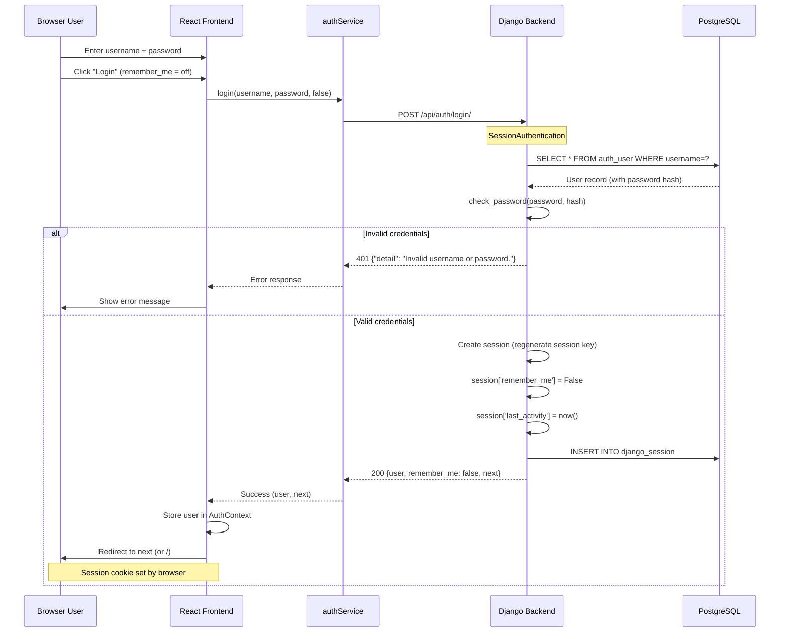
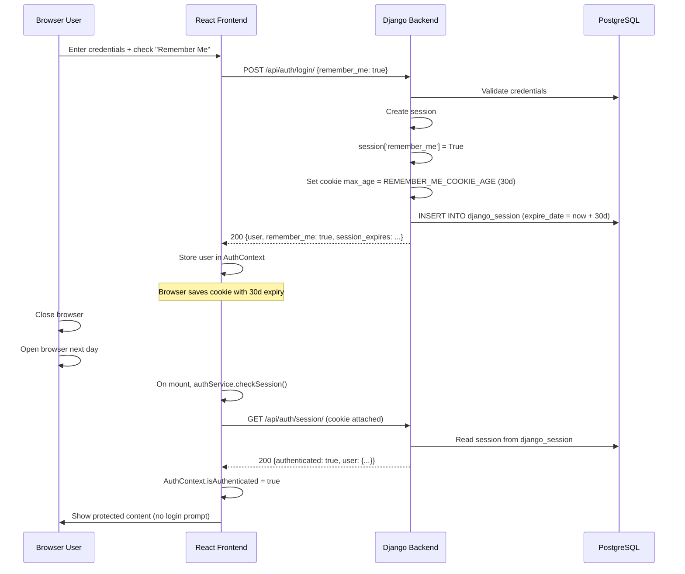
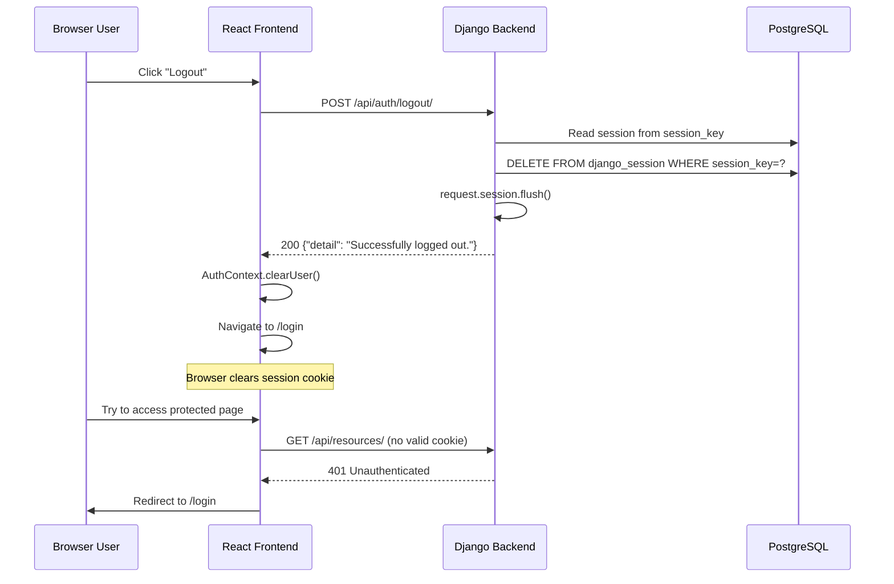
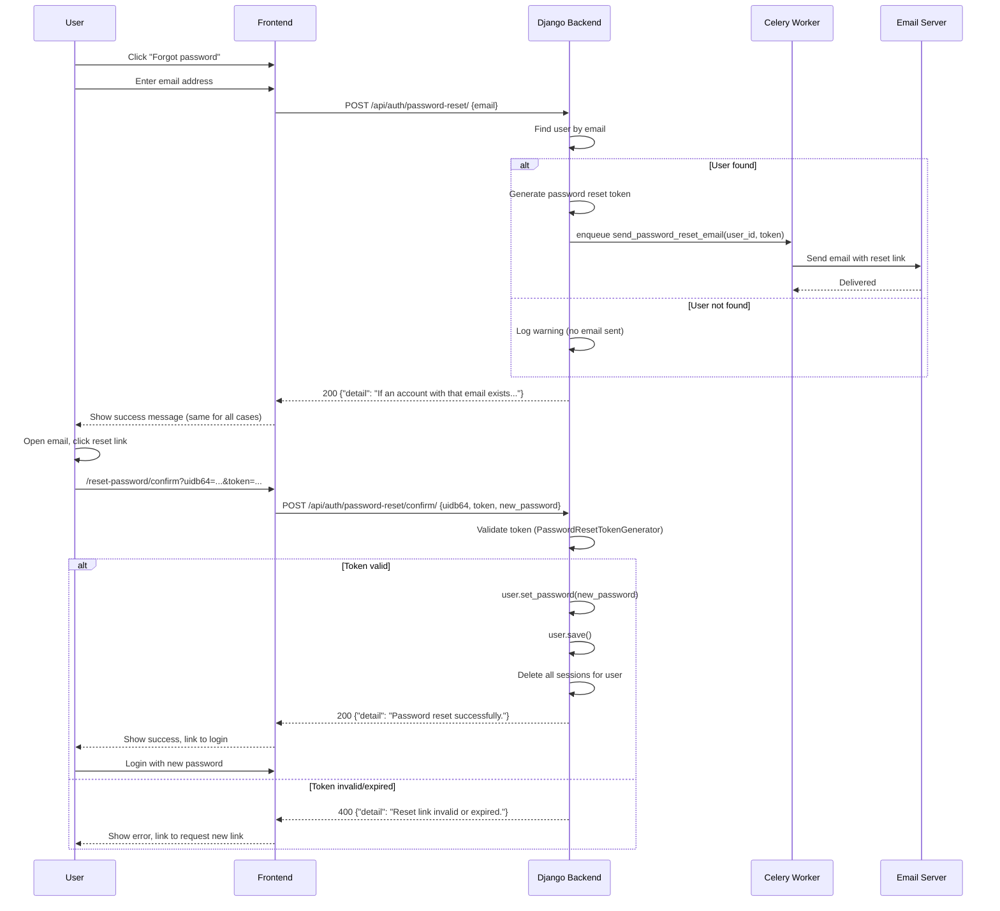
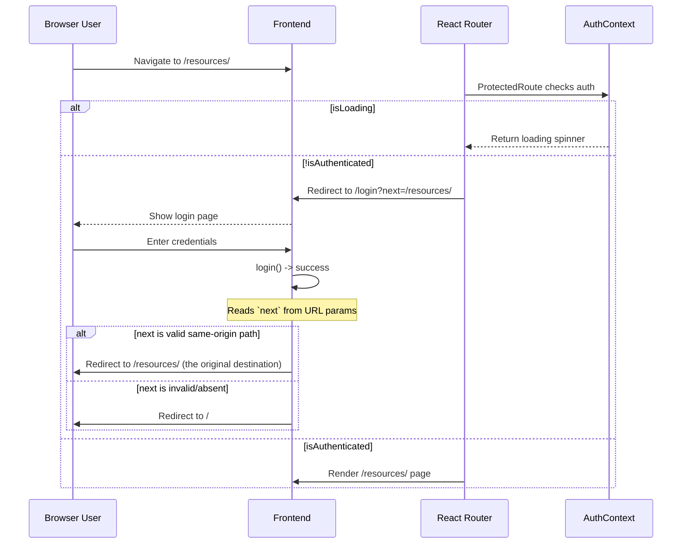
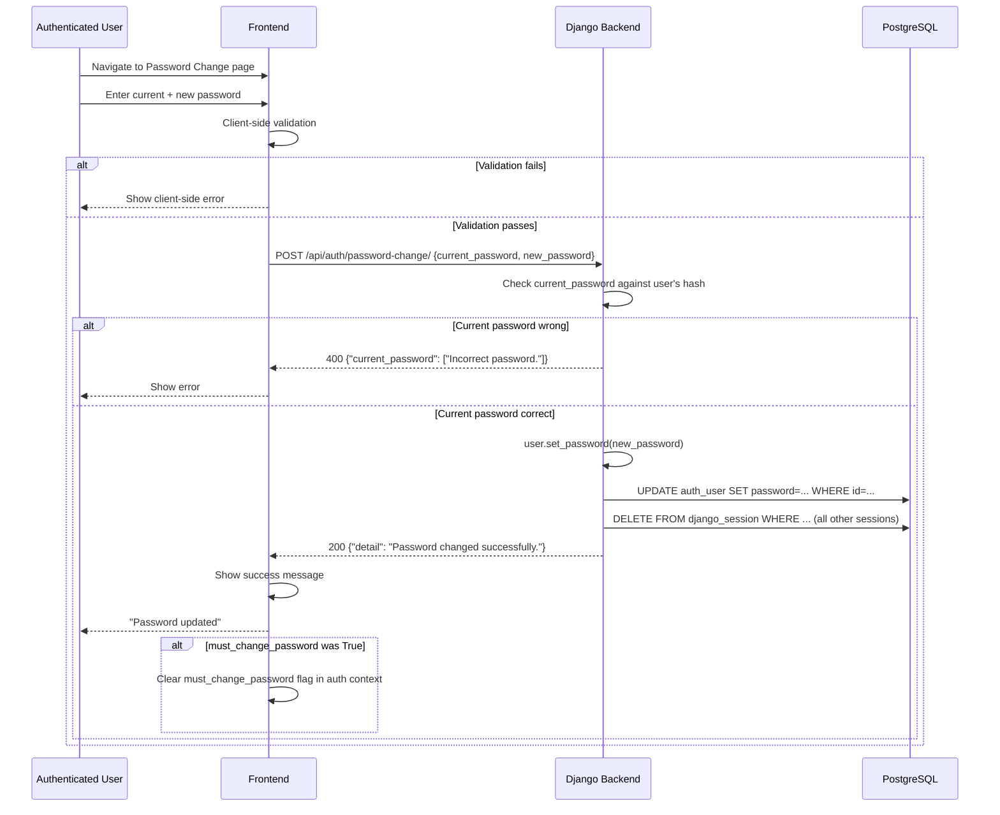

# F-001 — User Authentication — Technical Design

## 1. Metadata

| Field | Value |
|---|---|
| Feature ID | F-001 |
| Feature Title | User Authentication |
| Source Feature Specification | docs/project/features/F-001/feature-spec.md |
| Source Specification Status | Ready for Technical Planning |
| Source Specification Version | 1.0 |
| Technical Design Status | Ready for Engineering Review |
| Technical Design Version | 1.0 |
| Superseded Version | None |
| Owner | AGENT-103 — Technical Planner |
| Created | 2026-07-21 |
| Updated | 2026-07-21 |
| Next Intended Owner | AGENT-104 — Engineering Design Reviewer |

## Revision History

| Version | Date | Author | Changes | Resolved Return IDs |
|---|---|---|---|---|
| 1.0 | 2026-07-21 | AGENT-103 | Initial design | — |

## 2. Technical Overview

F-001 establishes the authentication foundation for the GeoSpatial Resource Platform using Django's built-in authentication framework extended with REST API endpoints via Django REST Framework.

**Selected approach:** Session-based authentication (no JWT, no API tokens) using Django's `SessionAuthentication` + CSRF protection. The `users` Django app provides all authentication endpoints: login, logout, password reset (email-based), password change (authenticated), session status check, and administrator user creation. Sessions are stored server-side in the database to support immediate invalidation on logout and password changes. Password reset uses Django's built-in `PasswordResetTokenGenerator` with async email delivery via Celery. "Remember me" is implemented via session expiry configuration — a longer absolute session lifetime with a session marker that exempts the session from idle-timeout enforcement.

**Architectural boundaries affected:** `users` app (authentication, sessions, password management), `jobs` app (Celery task for email sending), frontend auth service and React Context, and the authentication middleware stack.

## 3. Source Contract and Traceability

### Approved Product Contract

The approved Feature Specification (F-001, v1.0) defines: admin-provisioned user accounts, username+password login, server-side session management with configurable idle timeout, "Remember Me" persistent sessions, email-based password reset, authenticated password change, admin-initiated password reset, and unauthenticated user redirect. All business rules, user stories, functional requirements, acceptance criteria, and engineering attention flags are referenced below.

### Requirements-to-Design Traceability

| Requirement or Acceptance Criterion | Design Response | Design IDs or Sections |
|---|---|---|
| FR-F001-001 — Admin creates user account | Admin user creation endpoint with IsAdminUser permission | API-F001-007, CMP-F001-001 |
| AC-F001-001 — New user can log in | Login endpoint + session creation | API-F001-001, §13 Login Flow |
| FR-F001-002 / FR-F001-003 — Authenticate with credentials, create session | Login endpoint validates credentials, creates database session, sets session cookie | API-F001-001, DM-F001-002 |
| AC-F001-002 — Invalid credentials rejected | Login returns 401 with generic error | API-F001-001, §12 Error Handling |
| AC-F001-003 — Authenticated user accesses protected pages | SessionAuthentication + login-required mixin | CMP-F001-003, §13 |
| FR-F001-004 — Logout invalidates session | Logout endpoint flushes session | API-F001-002, §13 Logout Flow |
| AC-F001-004 — Post-logout redirect to login | Session flush + 200 response; frontend redirects | CMP-F001-005 |
| FR-F001-005 — Redirect unauthenticated to login with return URL | ProtectedRoute component reads `next` param | CMP-F001-006, §13 Redirect Flow |
| AC-F001-005 — Successful login redirects to original URL | Login endpoint returns `next`; frontend navigates | API-F001-001, CMP-F001-004 |
| FR-F001-006 / FR-F001-007 — Configurable idle timeout | SessionIdleTimeoutMiddleware checks `last_activity` in session | CMP-F001-002, §9 Configuration |
| AC-F001-006 — 30-min idle timeout enforced | Middleware compares idle time against configured `SESSION_IDLE_TIMEOUT` | ES-F001-001 |
| FR-F001-008 — "Remember Me" persists across browser restart | Login sets `remember_me` flag in session; longer cookie age | TD-F001-002, API-F001-001 |
| AC-F001-007 — Remember Me session survives browser close | Session cookie with `SESSION_COOKIE_AGE = REMEMBER_ME_AGE` | TD-F001-002, §9 |
| FR-F001-009 / FR-F001-010 / FR-F001-011 — Password reset email with token | Custom `PasswordResetView` + Celery email task | API-F001-003, API-F001-004, CMP-F001-001 |
| AC-F001-008 — Reset token single-use, time-limited | Django's `PasswordResetTokenGenerator`; 24h configurable expiry | API-F001-004, §9 |
| FR-F001-012 — Authenticated password change | PasswordChangeView with current password validation | API-F001-005, CMP-F001-001 |
| AC-F001-009 — Password change updates credentials | User.set_password() + session cleanup | DM-F001-001 |
| FR-F001-013 — Admin password reset for another user | Admin force-reset endpoint with next-login flag | API-F001-008, §10 Security |
| AC-F001-010 — Force password change on next login | `must_change_password` boolean on User model | DM-F001-001 |
| FR-F001-014 — Password policy enforcement | Custom validator: min 8 chars, mixed case, digit | TD-F001-006, §10 |
| AC-F001-011 — Weak password rejected | Validator returns 400 with specific error message | API-F001-005, §12 |
| FR-F001-015 — Salted, expensive hashing (no plain text) | Django PBKDF2 (default) + Argon2 support | TD-F001-001, DM-F001-001 |
| AC-F001-012 — No plain-text password in database | Hashed only; User.password uses Django hasher | DM-F001-001, §10 |
| EAF-F001-001 — Password storage security | Argon2PasswordHasher preferred; PBKDF2 fallback | TD-F001-001 |
| EAF-F001-002 — Session storage mechanism | Database session backend (`django.contrib.sessions`) | TD-F001-003 |
| EAF-F001-003 — Email delivery for password reset | Celery async task for email sending | TD-F001-004, CMP-F001-001 |
| EAF-F001-004 — Session timeout enforcement | Custom middleware tracking `last_activity` | CMP-F001-002 |
| EAF-F001-005 — "Remember Me" token security | Session-based with extended expiry; no separate token model | TD-F001-002 |
| EAF-F001-006 — Unauthenticated redirect flow | ProtectedRoute checks `next` param; same-origin validation | CMP-F001-006, §10 |
| EAF-F001-007 — Password policy enforcement | Validator in serializers; client + server enforcement | TD-F001-006 |

## 4. Architectural Context

### Relevant Current Architecture

The platform is a modular monolith (ADR-002) with Django apps organized by business capability. The `users` app is responsible for user management and authentication. The frontend is a React SPA with Material UI, using React Context for state management.

### Binding ADRs

- **ADR-001 (Resource-Centric Domain):** Authentication is an identity concern, orthogonal to resources. No resource model changes are introduced.
- **ADR-002 (Modular Monolith):** All authentication logic lives inside the `users` Django app. No new services or microservices.
- **ADR-003 (DRF for API):** All authentication endpoints use DRF views (APIView or ViewSet), not plain Django views.

### Existing Reusable Capabilities

- Django's `django.contrib.auth` — User model, authentication backend, session framework, password hashers, password reset token generator, permission system
- Django's `django.contrib.sessions` — Database-backed session store
- Django's CSRF middleware — Cross-site request forgery protection
- DRF's `SessionAuthentication` — Session-based auth integration for REST API
- Celery infrastructure — Async task queue for email delivery

### Affected Boundaries

- **`users` app:** All new endpoint views, serializers, authentication middleware, and session management live here.
- **`jobs` app:** A Celery task for password reset email sending (or the `users` app can define its own tasks).
- **Frontend:** New `AuthContext`, `AuthService`, login page, password reset pages, protected route wrapper.

### Material Documentation Discrepancies

No implementation exists yet. All architecture documents are current and consistent. No source inspection is needed.

## 5. Design Goals

1. **Security-first:** Password storage, session management, CSRF protection, and token generation must follow established Django security best practices.
2. **Foundation simplicity:** Use Django's built-in, battle-tested components. Avoid custom authentication backends, custom session stores, or JWT complexity.
3. **Server-side authority:** All security enforcement (session validity, password policy, token expiry) must be enforced server-side. Client-side checks are for UX only.
4. **Session invalidation:** Logout, password change, and administrator password reset must immediately invalidate all active sessions for the affected user.
5. **Configurability:** Session timeout, remember-me duration, password policy, and reset token expiry must be configurable through Django settings, not hardcoded.
6. **Observable failure:** Authentication failures must log security events without leaking user identity information in error messages.
7. **Async email:** Password reset email sending must not block the HTTP response. Use Celery for async delivery.

## 6. Technical Constraints

| Constraint | Source |
|---|---|
| Must use Django's built-in authentication as foundation | Handoff DEC-004 |
| Modular monolith — no microservices | ADR-002 |
| All API endpoints use DRF | ADR-003 |
| Single organization, no multi-tenancy | Handoff DEC-005 |
| No self-registration — admin-only account creation | HD-F001-001 (Feature Spec §19) |
| No OAuth/SSO, MFA, API tokens, account lockout | Feature Spec §10 (Out of Scope) |
| PostgreSQL database | PROJECT_FACTS |
| Celery + Redis for async tasks | PROJECT_FACTS |
| React + TypeScript + Material UI frontend | PROJECT_FACTS |
| Email infrastructure must be configured | DEP-F001-001 |

## 7. Technical Decisions and Alternatives

### TD-F001-001 — Password Hashing Algorithm

**Context:** Passwords must be stored using a salted, computationally-expensive hashing algorithm (FR-F001-015, EAF-F001-001).

**Selected approach:** Use Django's `Argon2PasswordHasher` as the primary hasher with `PBKDF2PasswordHasher` (Django 5 default, 720,000 iterations) as the fallback. Configure `PASSWORD_HASHERS` with Argon2 first.

**Alternatives considered:**
1. **PBKDF2 only (Django default):** Sufficient, well-tested, FIPS-140 compliant. But Argon2 is memory-hard and more resistant to GPU/ASIC attacks.
2. **bcrypt:** Good resistance, but Django support requires `django[bcrypt]` extra. Slower than Argon2 on modern hardware.
3. **Custom hashing:** Rejected — unnecessary risk. Django's built-in hashers are battle-tested and support algorithm migration automatically.

**Technical rationale:** Argon2 is the OWASP-recommended algorithm (as of 2023+). Django 5 supports it natively via `argon2-cffi`. Password upgrading happens automatically when a user logs in — if their password was hashed with PBKDF2, Django re-hashes it with Argon2 on successful login (the `password_upgrade` mechanism in Django's `check_password`).

**Consequences:** Requires `argon2-cffi` Python package. Existing passwords continue to work. Algorithm migration is seamless.

**Propagation:** Data Model (password field type), Security section, Configuration section.

### TD-F001-002 — "Remember Me" Implementation

**Context:** Users can select "Remember Me" at login for persistent sessions (FR-F001-008, US-F001-003, EAF-F001-005).

**Selected approach:** Implement entirely within Django's session framework — no separate token model. When "Remember Me" is checked:
1. The session's expiry (`SESSION_COOKIE_AGE`) is set to a longer duration (e.g., 30 days configurable via `REMEMBER_ME_COOKIE_AGE`).
2. A boolean marker `remember_me = True` is stored in the session data.
3. The idle-timeout middleware skips sessions with the `remember_me` marker.
4. Session cookie `max_age` is set accordingly.

**Alternatives considered:**
1. **Separate persistent token model:** Generate a random token, store it hashed in the database, and set it as a long-lived cookie. More complex, adds database load on every request, and requires manual token rotation.
2. **JWT refresh tokens:** Out of scope (no JWT). Adds complexity without benefit for a browser-based SPA.

**Technical rationale:** Django's session framework natively supports variable expiry. No additional models, migrations, or token-generation logic are needed. On password change or admin reset, all database sessions for that user are deleted — automatically invalidating "Remember Me" sessions.

**Consequences:** Database session store size increases with persistent sessions, but this is negligible at expected scale (<10K users). The session cookie `max_age` must be explicitly set in the login response.

**Propagation:** API (login request/response), Middleware (idle-timeout skip), Configuration (REMEMBER_ME_COOKIE_AGE), Security section.

### TD-F001-003 — Session Backend Selection

**Context:** Sessions must be stored and invalidated reliably (FR-F001-004, EAF-F001-002).

**Selected approach:** `django.contrib.sessions.backends.db` (database-backed sessions).

**Alternatives considered:**
1. **Cache-backed (`locmem` or Redis):** Faster reads/writes, but session data is lost on cache flush unless using a persistent Redis with persistence configured. Invalidation requires iterating cache keys.
2. **Signed cookies (`signed_cookies`):** No server-side storage — cannot invalidate individual sessions on the server. Rejected per FR-F001-004 (logout must immediately invalidate session).
3. **Cached database (`cached_db`):** Combines database persistence with cache speed. Preferable for production but requires Redis to be configured and operational from the start.

**Technical rationale:** Database sessions are the simplest approach that satisfies the invalidation requirement. Deleting all sessions for a user is a single `Session.objects.filter(session_key__in=...)` query. At expected scale (hundreds of concurrent users, not thousands), database session read/write overhead is negligible. The project can migrate to `cached_db` in the future without breaking changes.

**Consequences:** Session queries add database load. Each authenticated request reads the session from the database. If performance becomes a concern, the project should switch to `cached_db` backend.

**Propagation:** Configuration (SESSION_ENGINE), Migration (sessions table creation), Security section.

### TD-F001-004 — Password Reset Email Delivery

**Context:** Password reset requires email delivery (FR-F001-010, EAF-F001-003).

**Selected approach:** Implement a Celery task `users.tasks.send_password_reset_email` that calls Django's `send_mail`. The password reset API view creates the token and enqueues the Celery task, returning immediately to the client.

**Alternatives considered:**
1. **Synchronous email:** Simpler implementation but blocks the HTTP response for the duration of SMTP communication. Under load, this can cause request queueing and timeouts.
2. **Django's built-in `PasswordResetView`:** Designed for server-rendered templates, not DRF API. Would require significant adaptation.

**Technical rationale:** Celery is already in the project stack. Sending email asynchronously ensures the API responds quickly (sub-100ms) even when the SMTP server is slow or temporarily unavailable. The task is fire-and-forget with retry (Celery's `max_retries=3, default_retry_delay=60`).

**Consequences:** Requires the `users` app to import Celery from the project's Celery app. Email delivery failures are reported through Celery's error handling, not through the HTTP response. A fallback admin reset path exists (FR-F001-013).

**Propagation:** Component (CMP-F001-001), Integration (INT-F001-001), Engineering Scenarios (ES-F001-003).

### TD-F001-005 — Session Idle Timeout Mechanism

**Context:** Idle timeout requires tracking user activity to expire inactive sessions (FR-F001-006, FR-F001-007, EAF-F001-004).

**Selected approach:** Custom middleware `SessionIdleTimeoutMiddleware` that:
1. For authenticated requests without `remember_me` flag, updates a `last_activity` timestamp in the session.
2. On every request, compares current time against `last_activity + SESSION_IDLE_TIMEOUT`.
3. If exceeded, flushes the session and returns a 401 response (or redirect for the frontend).
4. The middleware runs after authentication middleware but before view processing.

**Alternatives considered:**
1. **Django's `SESSION_COOKIE_AGE` only:** Sets absolute session lifetime, not idle timeout. A user could be active for hours but still be logged out at the cookie age boundary. Does not satisfy FR-F001-007 (idle timeout on inactivity).
2. **Client-side activity detection:** JavaScript pings a keep-alive endpoint on user interaction. More complex, adds network traffic, and can be bypassed by disabling JS. Security enforcement must be server-side.
3. **`SESSION_SAVE_EVERY_REQUEST`:** Django saves the session on every request, updating the cookie expiry. But this acts as a rolling expiration, not a sleep-and-expire idle timeout.

**Technical rationale:** Server-side timestamp comparison is the most reliable idle timeout mechanism. The middleware adds minimal overhead (one date comparison + one session write per request). The `last_activity` timestamp is small (12 bytes). For unauthenticated requests and `remember_me` sessions, the middleware is a no-op pass-through.

**Consequences:** Every authenticated request writes to the session (to update `last_activity`). This increases database write load. The performance impact is acceptable for the expected user count.

**Propagation:** Component (CMP-F001-002), Configuration (SESSION_IDLE_TIMEOUT), Engineering Scenarios (ES-F001-001).

### TD-F001-006 — Password Policy Validation Rules

**Context:** Password policy must enforce minimum requirements (FR-F001-014, EAF-F001-007).

**Selected approach:** Custom Django validator `validate_password_strength` in `users.validators`:
- Minimum length: 8 characters (configurable via `MIN_PASSWORD_LENGTH`)
- At least one uppercase letter
- At least one lowercase letter
- At least one digit
- Applied at the serializer level for account creation, password change, and password reset confirmation.

**Alternatives considered:**
1. **Django's built-in validators:** `MinimumLengthValidator` (length only), `CommonPasswordValidator` (checks against common passwords), `NumericPasswordValidator` (not entirely numeric). We'll use `MinimumLengthValidator` and add custom character-class validators.
2. **Third-party library (e.g., `django-password-validators`):** Adds dependency with minimal benefit. Custom validators are <50 lines of code.
3. **Client-only validation:** Rejected — server-side enforcement is mandatory for security.

**Technical rationale:** Custom validators give precise control over the policy and make configuration straightforward. The validators return user-friendly error messages (e.g., "Password must contain at least one uppercase letter"). The frontend mirrors these rules for UX, but the server is authoritative.

**Consequences:** Password policy is enforced wherever a password is set (create user, change password, reset password). Configuration is in Django settings (`AUTH_PASSWORD_VALIDATORS`).

**Propagation:** API (serializer validation), Frontend (client-side validation), Configuration (AUTH_PASSWORD_VALIDATORS).

### TD-F001-007 — User Model Identifier Type

**Context:** The domain model specifies `UUID id` for User, but Django's default User model uses auto-incrementing integer PKs.

**Selected approach:** Use Django's default `AutoField` (integer) primary key for the User model. Do NOT use UUID primary keys for the auth User model.

**Alternatives considered:**
1. **UUID primary key:** Provides globally unique identifiers, harder to guess, better for future distributed systems. However, Django's `django.contrib.auth` and session framework have many internal foreign key relationships that assume integer PKs. UUID PKs introduce performance overhead (index size, join speed) and complexity in session lookups.
2. **Custom abstract user with UUID:** Technically feasible but adds migration complexity for the session and permission tables.

**Technical rationale:** Django has supported custom user models since 1.5, but using UUID as the primary key for the auth model introduces unnecessary complexity for this project. Session lookups by user ID are frequent, and integer PKs are faster. The resource domain model can still use UUID for Resource IDs. The User model's integer PK is an internal implementation detail.

**Consequences:** User IDs are sequential integers, exposed in some API responses. This is acceptable for an internal organizational platform. If UUIDs are needed later (e.g., for a distributed system), a separate public UUID field can be added.

**Propagation:** Data Model (DM-F001-001), API contracts (user_id field type).

## 8. Component Design

### CMP-F001-001 — Users Django App (Backend)

**Type:** Extended (existing logical module from component-design.md)

**Responsibility:** All authentication operations — login, logout, password management, session management, admin user creation.

**Structure:**

```
users/
  __init__.py
  admin.py           — Django admin configuration for User model
  models.py          — User model (custom AbstractUser)
  serializers.py     — LoginSerializer, UserCreateSerializer, PasswordChangeSerializer,
                       PasswordResetSerializer, PasswordResetConfirmSerializer, SessionSerializer
  views.py           — LoginView, LogoutView, SessionView, PasswordResetView,
                       PasswordResetConfirmView, PasswordChangeView, UserCreateView
  urls.py            — URL routing for all auth endpoints
  authentication.py  — Custom authentication classes (if needed beyond DRF defaults)
  permissions.py     — IsAdminUserForCreation (admin-only user creation)
  validators.py      — Password strength validators
  middleware.py      — SessionIdleTimeoutMiddleware
  tasks.py           — Celery task for sending password reset email
  utils.py           — Helper functions (session invalidation helpers)
  tests/             — Test module
```

**Inputs and outputs:** HTTP request → HTTP response. Internal calls to Django's auth framework and session store.

**State and data ownership:** Owns the User model, session store configuration (via `django.contrib.sessions`), password reset token state (via `PasswordResetTokenGenerator`).

**Dependencies:** `django.contrib.auth`, `django.contrib.sessions`, `django.contrib.contenttypes` (for permissions), Celery app (for email tasks).

**Failure boundary:** All authentication failures are handled within the view layer and return appropriate HTTP error responses. No cascading failures to other modules.

**Reuse rationale:** The `users` app already owns identity in the architecture. Extending it with authentication endpoints is the natural boundary.

### CMP-F001-002 — SessionIdleTimeoutMiddleware

**Type:** New component

**Responsibility:** Enforce idle session timeout for non-remember-me sessions.

**Behavior:**
1. Skip unauthenticated requests and requests without a session.
2. If session has `remember_me=True`, skip.
3. Get `last_activity` from session. If absent, set it to `timezone.now()` and save.
4. If `last_activity + SESSION_IDLE_TIMEOUT < timezone.now()`, flush the session and set `session_expired = True` on the request.
5. Otherwise, update `last_activity` to `timezone.now()`.

**Middleware ordering:** Must run after `django.contrib.sessions.middleware.SessionMiddleware` and `django.contrib.auth.middleware.AuthenticationMiddleware`, but before DRF's authentication. Position in `MIDDLEWARE`: `'users.middleware.SessionIdleTimeoutMiddleware'` after `'django.contrib.auth.middleware.AuthenticationMiddleware'`.

**Failure boundary:** If the middleware encounters an error reading the session, it logs the error and passes the request through (fail-open would log the user out, fail-closed would block all traffic. We choose fail-open with logging because session corruption should not deny service).

### CMP-F001-003 — LoginRequiredMixin / IsAuthenticated Permission

**Type:** Reused from DRF

**Responsibility:** Protect views that require authentication.

**Implementation:** Use DRF's `IsAuthenticated` permission class as the default for all protected API views. For the frontend, a React `<ProtectedRoute>` component handles redirect logic.

### CMP-F001-004 — Frontend Auth Service

**Type:** New component

**Responsibility:** Wrapper around the authentication API.

```
frontend/src/services/authService.ts
```

**Exports:**
- `login(username, password, rememberMe)` → calls POST `/api/auth/login/`
- `logout()` → calls POST `/api/auth/logout/`
- `checkSession()` → calls GET `/api/auth/session/`
- `requestPasswordReset(email)` → calls POST `/api/auth/password-reset/`
- `confirmPasswordReset(uid, token, newPassword)` → calls POST `/api/auth/password-reset/confirm/`
- `changePassword(currentPassword, newPassword)` → calls POST `/api/auth/password-change/`

**CSRF handling:** On every mutating request, reads `csrftoken` cookie from `document.cookie` and includes it as `X-CSRFToken` header. The initial GET request to any page sets the CSRF cookie.

### CMP-F001-005 — Frontend Auth Context

**Type:** New component

**Responsibility:** React Context providing authentication state to the entire component tree.

```
frontend/src/context/AuthContext.tsx
```

**State:**
- `user: User | null` — Current user object (id, username, email, is_staff, must_change_password)
- `isAuthenticated: boolean`
- `isLoading: boolean` — True while initial session check is in progress
- `sessionExpired: boolean` — Set to true when idle timeout occurs, triggers a toast/notification

**Methods:**
- `login(username, password, rememberMe)` — Calls auth service, sets user state on success
- `logout()` — Calls auth service, clears user state, navigates to `/login`
- `checkSession()` — Calls GET `/api/auth/session/`, updates user state. Called on app mount.

**Initialization:** On app mount, `AuthContext` calls `checkSession()` to restore the session from the existing cookie. If it returns 401, `isAuthenticated` is set to `false`. This handles page refreshes and browser restarts (for "Remember Me").

### CMP-F001-006 — ProtectedRoute Wrapper

**Type:** New component

**Responsibility:** Protect routes that require authentication.

```
frontend/src/components/auth/ProtectedRoute.tsx
```

**Behavior:**
1. If `isLoading`, show a loading spinner (prevents flash of login page on refresh).
2. If `!isAuthenticated`, redirect to `/login?next={currentPath}`.
3. If `isAuthenticated && must_change_password`, redirect to `/password-change?forced=true`.
4. Otherwise, render the children.

**Open-redirect prevention:** The `next` parameter is validated on the login page before redirect. Only same-origin, relative paths are accepted. Full URLs (containing `://` or starting with `//`) are rejected. This satisfies EAF-F001-006.

### CMP-F001-007 — Frontend Login Page

**Type:** New component

**Responsibility:** Login form with username, password, "Remember Me" checkbox, "Forgot password" link.

```
frontend/src/pages/auth/LoginPage.tsx
```

**Behavior:**
- On mount, reads `next` query parameter from URL.
- On submit, calls `authService.login()`.
- On success, navigates to `next` or `/` if no next parameter.
- On error, displays error message (generic "Invalid credentials" for 401).
- "Forgot password" link navigates to `/forgot-password`.

### CMP-F001-008 — Frontend Password Reset Pages

**Type:** New components

**Components:**
- `ForgotPasswordPage.tsx` — Email input form. Calls `authService.requestPasswordReset(email)`. Shows success message regardless of whether the email exists (no information leakage).
- `ResetPasswordConfirmPage.tsx` — Reads `uidb64` and `token` from URL query params. Shows new password form on valid token. Calls `authService.confirmPasswordReset()`. On success, navigates to `/login` with success message.

### CMP-F001-009 — Frontend Password Change Page

**Type:** New component

**Responsibility:** Allow authenticated user to change their password.

```
frontend/src/pages/auth/PasswordChangePage.tsx
```

**Behavior:**
- Requires current password + new password + confirm new password.
- Client-side validation mirrors server-side rules (min length, character classes).
- On success, shows confirmation and may require re-login (depending on session invalidation behavior).
- If `?forced=true` query param is present, shows a banner explaining the password change is required before proceeding (AC-F001-010).

## 9. Data Model Changes

### DM-F001-001 — User Model (Custom AbstractUser)

**Strategy:** Use Django's `AbstractUser` to create a custom User model. This extends Django's built-in User with additional fields.

**Fields:**

| Field | Type | Nullable | Default | Description |
|---|---|---|---|---|
| id | AutoField (integer) | No | Auto | Primary key (TD-F001-007) |
| username | CharField(150, unique) | No | — | Username for login |
| email | EmailField(unique) | No | — | Email for password reset and notifications |
| password | CharField(128) | No | — | Password hash (Django hasher) |
| first_name | CharField(150) | Yes | '' | First name |
| last_name | CharField(150) | Yes | '' | Last name |
| is_active | BooleanField | No | True | Whether the user can log in |
| is_staff | BooleanField | No | False | Whether user can access admin |
| is_superuser | BooleanField | No | False | Superuser status |
| date_joined | DateTimeField | No | Auto | When user was created |
| last_login | DateTimeField | Yes | None | Last login timestamp (from AbstractBase) |
| must_change_password | BooleanField | No | False | Flag for admin-initiated password reset (FR-F001-013, AC-F001-010) |

**Invariants:**
- `username` is unique (validated at model and DB level).
- `email` is unique (validated at model and DB level).
- `password` is never stored in plain text (Django hasher, see TD-F001-001).
- `is_active=False` prevents login but does not cascade-delete related data.

**Relationship to existing domain model:** The domain model in `domain-model.md` defines User with `{UUID id, string username, string email, string password_hash, boolean is_active, datetime created_at}`. This design extends that with Django's standard fields plus `must_change_password`. The `id` field uses integer PK instead of UUID (see TD-F001-007).

**Migration and backfill:** Initial migration creates the `users_user` table. No data migration needed for a fresh project. The `createsuperuser` management command creates the first superuser.

**Related models (from Django):**
- `django.contrib.auth.models.Group` — for future F-002 (unchanged, used by Django's permission system)
- `django.contrib.auth.models.Permission` — for future F-007 (unchanged)
- `django.contrib.sessions.models.Session` — server-side session storage (see DM-F001-002)

### DM-F001-002 — Session Store

**Technology:** `django.contrib.sessions.backends.db` (see TD-F001-003).

**Model:** `django.contrib.sessions.models.Session` (already part of Django, migrated via `python manage.py migrate sessions`).

**Key fields:**

| Field | Type | Description |
|---|---|---|
| session_key | CharField(40, primary_key) | Random session key |
| session_data | TextField | Pickled session data (including `last_activity`, `remember_me`, `_auth_user_id`) |
| expire_date | DateTime(indexed) | Session expiration datetime |

**Invariants:**
- `expire_date` is indexed for the session cleanup management command (`clearsessions`).
- `session_data` contains `_auth_user_id` (integer FK to User), `last_activity` (datetime), optionally `remember_me` (bool).

**Query implications:**
- Finding all sessions for a user: `Session.objects.filter(session_data__contains=user_id)` — this isn't efficient. A better approach for password-change invalidation is to call `Session.objects.filter(expire_date__gt=timezone.now()).delete()` for each session key... Actually, Django doesn't natively support querying sessions by user ID efficiently with the database backend. We'll implement a utility function that iterates sessions and decodes them, or better, we'll add a `UserSession` model for direct user-to-session mapping if needed.

Wait — let me reconsider. Django's `Session` model stores user ID inside the pickled `session_data`. Querying by user ID requires decoding each session. For Milestone 1 with expected small user counts, this is acceptable. But we can add a simpler approach: on password change/reset, we simply delete ALL expired sessions for the user.

Actually, Django's `Session.objects.filter(..., expire_date__gt=now)` and iterating with `.decoded()` to find the right user_id is the standard approach. We'll create a utility function for this.

A more robust approach: on password change, we can store a `auth_version` integer on the User model, increment it on password change, and check it in the SessionIdleTimeoutMiddleware. If the session's `auth_version` doesn't match the user's current one, the session is invalid. But this adds complexity for Milestone 1.

For simplicity in F-001: On logout → `request.session.flush()`. On password change → clear current session. On admin reset → delete all sessions for the user via iteration.

**Migration:** `python manage.py migrate sessions` creates the `django_session` table. This is a Django contrib migration, not a project migration.

### DM-F001-003 — Password Reset Token

**No dedicated model.** Django's `PasswordResetTokenGenerator` generates tokens without database storage. Token validity is derived from:
- The user's PK (encoded in `uidb64`)
- The user's `last_login` timestamp
- The user's password hash (changing password invalidates existing tokens)
- A secret key (`SECRET_KEY`)
- A timeout (default 3 days, configurable)

**Why no model:** The token is self-contained (tamper-evident via HMAC). Valve expiry is checked via the `last_login` and `password` hash. This eliminates the need for a token storage table, and tokens are naturally single-use because a password change changes the password hash, invalidating all existing tokens.

**Token expiry:** Configured via `PASSWORD_RESET_TIMEOUT` (Django setting, in seconds, default 259200 = 3 days). Per the feature spec (FR-F001-011), this should be configurable. We'll set it to 86400 (24 hours) as the default.

## 10. API Design

### API-F001-001 — POST /api/auth/login/

**Purpose:** Authenticate user with username and password, create a session.

**Authentication required:** No

**Request body:**
```json
{
  "username": "string (required)",
  "password": "string (required)",
  "remember_me": "boolean (optional, default false)"
}
```

**Validation:**
- `username` — required, non-empty string
- `password` — required, non-empty string
- `remember_me` — optional boolean, defaults to false

**Success response (200):**
```json
{
  "user": {
    "id": 1,
    "username": "jdoe",
    "email": "jdoe@example.com",
    "is_staff": false,
    "must_change_password": false
  },
  "next": "/resources/",
  "remember_me": true,
  "session_expires": "2026-08-20T12:00:00Z"
}
```

**Error response (401):**
```json
{
  "detail": "Invalid username or password."
}
```
Generic error — does not indicate which field was wrong (prevents user enumeration).

**CSRF:** Required (mutating request). Need to ensure the CSRF cookie is set. On first GET to any page, Django sets the `csrftoken` cookie. The login page makes a GET to `/api/auth/session/` (or any endpoint) before POST to get the CSRF cookie.

**Session behavior:**
- On success, Django creates a new session (with a new session key to prevent session fixation).
- `request.session['_auth_user_id']` = user.id
- If `remember_me=True`: `request.session['remember_me'] = True`, set `max_age` on session cookie to `settings.REMEMBER_ME_COOKIE_AGE`.
- If `remember_me=False` or absent: `request.session['remember_me'] = False`, `request.session['last_activity'] = timezone.now()`.

**Idempotent:** No — each call creates a new session (unless already authenticated, in which case return 200 with existing user info).

### API-F001-002 — POST /api/auth/logout/

**Purpose:** Invalidate current session (FR-F001-004).

**Authentication required:** Required (valid session)

**Request body:** (empty)

**Success response (200):**
```json
{
  "detail": "Successfully logged out."
}
```

**Error response (401):**
```json
{
  "detail": "Authentication credentials were not provided."
}
```

**Session behavior:**
- `request.session.flush()` — deletes the session from the database and creates a new empty session (to prevent session fixation).
- CSRF token cookie is cleared (session cookie cleared by setting max_age=0).

**Idempotent:** Yes — calling logout multiple times returns 200 (idempotent success). The second call has no session to flush.

### API-F001-003 — POST /api/auth/password-reset/

**Purpose:** Request a password reset email (FR-F001-009, FR-F001-010).

**Authentication required:** No

**Request body:**
```json
{
  "email": "string (required)"
}
```

**Success response (200):**
```json
{
  "detail": "If an account with that email exists, a password reset link has been sent."
}
```
Always returns 200 regardless of whether the email exists (prevents user enumeration). Logs a warning if email doesn't exist.

**Error response:** No specific error for missing email. Returns 200 in all cases with the same message. If email sending fails (internal error), the Celery task logs the error and may retry.

**Side effect:** Enqueues a Celery task `users.tasks.send_password_reset_email` with user ID (if found) and reset token.

**Rate limiting:** Apply `django.core.cache`-based rate limiting: max 3 requests per email per hour to prevent abuse.

**Idempotent:** Yes — multiple requests for the same email within the expiry period regenerate the same token (because it's based on `last_login` + password hash, which haven't changed). Each request enqueues a new email, so practical idempotency is "at most one email per request" but the token is the same.

### API-F001-004 — POST /api/auth/password-reset/confirm/

**Purpose:** Complete password reset with token (FR-F001-011, AC-F001-008).

**Authentication required:** No

**Request body:**
```json
{
  "uidb64": "string (required, base64-encoded user PK)",
  "token": "string (required, from reset email)",
  "new_password": "string (required, meets password policy)"
}
```

**Validation:**
- `uidb64` — must be valid base64 encoding of a user PK
- `token` — must be valid and not expired (checked via `PasswordResetTokenGenerator.check_token()`)
- `new_password` — must pass password strength validators

**Success response (200):**
```json
{
  "detail": "Password has been reset successfully."
}
```

**Error responses:**
- 400: `{"new_password": ["Password must be at least 8 characters."]}` — validation errors
- 400: `{"detail": "The password reset link is invalid or has expired."}` — invalid/expired token

**Side effect:** Calls `user.set_password(new_password)`. Increments `last_login` (via `user.set_password()` behavior) which invalidates the token. Deletes all existing sessions for the user.

**Idempotent:** No — once used, the token is invalid. Second call returns 400.

### API-F001-005 — POST /api/auth/password-change/

**Purpose:** Change password while authenticated (FR-F001-012, AC-F001-009).

**Authentication required:** Required (valid session)

**Request body:**
```json
{
  "current_password": "string (required)",
  "new_password": "string (required, meets password policy)"
}
```

**Validation:**
- `current_password` — must match the user's current password
- `new_password` — must pass password strength validators, must not be the same as current (optional but recommended)

**Success response (200):**
```json
{
  "detail": "Password changed successfully."
}
```

**Error responses:**
- 400: `{"current_password": ["Your current password is incorrect."]}`
- 400: `{"new_password": ["Password must be at least 8 characters."]}`
- 401 without valid session

**Session behavior:**
- After successful password change, all existing sessions for this user are deleted (including "Remember Me" sessions from other devices).
- The current session is preserved (the user is already authenticated and the password hash in the session metadata can be refreshed). Alternative: require re-login after password change. The more secure approach is to keep the current session (the user just proved their identity) but invalidate all others.

**Idempotent:** No — after the first call, `current_password` doesn't match the new password (it matches the old one). Second call with the old `current_password` fails 400.

### API-F001-006 — GET /api/auth/session/

**Purpose:** Check current session status. Returns user info if authenticated.

**Authentication required:** Optional (returns user if authenticated, null if not)

**Response (200, authenticated):**
```json
{
  "authenticated": true,
  "user": {
    "id": 1,
    "username": "jdoe",
    "email": "jdoe@example.com",
    "is_staff": false,
    "must_change_password": false
  },
  "session_expires": "2026-08-20T12:00:00Z",
  "remember_me": false
}
```

**Response (200, unauthenticated):**
```json
{
  "authenticated": false,
  "user": null
}
```

**Purpose:** Used by frontend on mount to check if a valid session exists (from cookie), and by the session checker to detect expired sessions.

**Side effects:** Updates `last_activity` for non-remember-me sessions (via middleware).

### API-F001-007 — POST /api/auth/users/

**Purpose:** Administrator creates a new user account (FR-F001-001, US-F001-001).

**Authentication required:** Required + IsAdminUser

**Request body:**
```json
{
  "username": "string (required, unique)",
  "email": "string (required, unique)",
  "password": "string (required, meets password policy)",
  "first_name": "string (optional)",
  "last_name": "string (optional)",
  "is_staff": "boolean (optional, default false)"
}
```

**Success response (201):**
```json
{
  "id": 2,
  "username": "jdoe",
  "email": "jdoe@example.com",
  "first_name": "",
  "last_name": "",
  "is_staff": false,
  "date_joined": "2026-07-21T10:00:00Z"
}
```

**Error responses:**
- 400: `{"username": ["A user with that username already exists."]}` — validation errors
- 403: `{"detail": "You do not have permission to perform this action."}` — non-admin
- 401: Not authenticated

**Note:** The password field is write-only (not included in response). The response never exposes the password hash.

### API-F001-008 — POST /api/auth/users/{id}/force-reset-password/

**Purpose:** Administrator forces a password reset for another user (FR-F001-013, AC-F001-010).

**Authentication required:** Required + IsAdminUser

**Request body:**
```json
{
  "new_password": "string (required, meets password policy)"
}
```

**Success response (200):**
```json
{
  "detail": "Password has been reset. User must change password on next login."
}
```

**Side effect:**
- Sets `user.must_change_password = True`
- Calls `user.set_password(new_password)`
- Deletes ALL sessions for this user (force logout from all devices)

**Note:** The user receives no email notification. The admin is expected to communicate the new password out of band.

## 11. Integration Points

### INT-F001-001 — Email Service Integration (Password Reset)

**Systems involved:** `users` Django app → Celery → SMTP server (via Django's email backend)

**Contract and ownership:** The `users` app defines a Celery task `send_password_reset_email`. The task calls Django's `send_mail()` using the configured email backend (SMTP, console, or file-based for dev).

**Direction and timing:** Asynchronous — the password reset view enqueues the task and returns immediately. The task runs on the next available Celery worker.

**Consistency expectations:** Best-effort delivery. The HTTP response does not wait for email confirmation. Task retry handles transient SMTP failures.

**Timeout, retry, and idempotency:**
- Celery `task_soft_time_limit`: 60 seconds
- Celery `max_retries`: 3
- `default_retry_delay`: 60 seconds (1 min between retries)
- Task is idempotent — multiple sends of the same email are acceptable

**Failure isolation:** SMTP failures do not affect the HTTP response (task is async). Task failure is logged via Celery's logging. A monitoring check should alert if email tasks consistently fail.

**Compatibility:** Uses Django's `send_mail()` which adapts to any configured email backend. Development environments use `console.EmailBackend` (prints to stdout) or `filebased.EmailBackend` (writes to files).

## 12. Storage Strategy

**Storage class and ownership:**
- User data: PostgreSQL `users_user` table (`users` app owns the model).
- Session data: PostgreSQL `django_session` table (`django.contrib.sessions` owns the model, managed via Django migrations).
- Password reset tokens: No storage (self-contained tokens).

**Expected data lifecycle:**
- User records persist indefinitely (no soft-delete initially).
- Session records expire and are cleaned up by Django's `clearsessions` management command (run via cron: `python manage.py clearsessions`).
- Password reset tokens have no storage — they validate without DB lookups.

**Capacity implications:**
- `users_user`: ~200 bytes per row. 1000 users = ~200 KB. Negligible.
- `django_session`: ~1 KB per active session. 1000 active sessions = ~1 MB. Historically grows with the `clearsessions` cron ensuring cleanup.

**Access patterns:**
- User record: Read on every login (by username). Read on every authenticated request (by user ID via session middleware). Write on password change and profile update.
- Session record: Read on every authenticated request. Write on every request (for `last_activity` update) and on login/logout.

**Integrity:**
- User table: Unique constraints on `username` and `email`. Foreign key from session `_auth_user_id` is implicit (Django's convention).
- Session table: No foreign key to User (Django's design decision). Cleanup by cron ensures no orphaned sessions persist indefinitely.

**Retention and deletion:**
- Users are never hard-deleted initially. An `is_active=False` flag deactivates them.
- Sessions are deleted on logout (programmatic) and by `clearsessions` cron (clears expired sessions).

## 13. Runtime and Data Flows

### Login Flow (without "Remember Me")



### Login Flow (with "Remember Me")



### Logout Flow



### Password Reset Flow



### Unauthenticated Redirect Flow



### Password Change Flow



## 14. Performance Strategy

**Critical paths:**
1. **Login (unauthenticated → authenticated):** Two DB queries (user lookup + password hash verification + session insert). Expected latency: <50ms.
2. **Authenticated request:** One DB query (session read) + middleware check (in-memory). Expected latency: <20ms.
3. **Password reset request:** User lookup (one DB query) + token generation (CPU, <1ms) + Celery task enqueue (Redis, <5ms). Expected latency: <30ms.

**Expected data volumes:**
- Users: <1000 for initial deployment (single organization).
- Active sessions: <100 concurrent.
- Password reset requests: <10/day.

**Latency/throughput constraints:** None specific to F-001. Authentication is not expected to be a bottleneck.

**Query and transfer bounds:**
- Session middleware reads the session on every authenticated request. With database-backed sessions, this is one SELECT per request. At 100 concurrent users making ~10 requests/minute, that's ~17 reads/second — negligible for PostgreSQL.
- No pagination needed for auth endpoints (single-record responses).

**Caching/precomputation:**
- No caching needed for F-001. Session reads go directly to PostgreSQL.
- If performance becomes a concern, switch to `cached_db` session backend.

**Protection against unbounded work:**
- Password reset rate limiting: max 3 requests per email per hour.
- Login rate limiting: max 10 failed attempts per IP per minute (via DRF throttling or Django's cache framework). This is recommended even though account lockout is out of scope (Feature Spec §10 says "engineering may choose to implement [rate limiting] for security").

## 15. Scalability Strategy

**Users growth:** The User model with integer PK supports up to 2 billion users (PostgreSQL `integer` range). More than sufficient.

**Session growth:** Database-backed sessions scale to tens of thousands of concurrent sessions with proper indexing (`expire_date` is already indexed). The `clearsessions` cron must run daily (or hourly at scale) to remove expired rows.

**Background workload:** The Celery email task is low volume (<100 emails/day at expected scale). No scalability concern.

**External integrations:** The SMTP server is the bottleneck for password reset emails. Celery retries handle transient failures. If SMTP throughput is insufficient, an email service provider (SendGrid, SES) can be configured via Django's email backend.

**Practical scaling boundaries:**
- At ~10,000 active sessions, consider migrating to `cached_db` session backend with Redis to reduce database read load.
- At ~50,000 users, consider adding a `last_login` index for the password reset flow.

## 16. Security and Privacy

### Authentication

- **Password storage:** Argon2 (preferred) with PBKDF2 fallback. Both are salted and computationally expensive (TD-F001-001). Django automatically handles salt generation and storage.
- **Session key generation:** Django uses `secrets.token_urlsafe()` (cryptographically random, 32 bytes). Session keys are never exposed to the client except as a cookie value (signed with `SECRET_KEY`).
- **CSRF protection:** Django's CSRF middleware is enabled. The frontend reads the `csrftoken` cookie and sends it as `X-CSRFToken` header on mutating requests. The CSRF cookie is `HttpOnly=False` (so JavaScript can read it) but `SameSite=Lax` by default.
- **Session fixation protection:** On login, `request.session.cycle_key()` is called (Django's `login()` does this automatically) — a new session key is generated, preventing fixation attacks.

### Authorization

- **Unauthenticated access:** Login, password reset, and password reset confirm endpoints are public. All other auth endpoints (logout, password change, session check) require authentication.
- **Admin-only endpoints:** User creation (`POST /api/auth/users/`) and force password reset (`POST /api/auth/users/{id}/force-reset-password/`) require `IsAdminUser`.
- **Object-level authorization:** A user can only change their own password. Admin endpoints can operate on any user.

### Session Security

- **Session timeout:** Configurable idle timeout (default 30 minutes) enforced server-side via `SessionIdleTimeoutMiddleware` (CMP-F001-002).
- **"Remember Me" sessions:** Longer lifetime (default 30 days) but still subject to session deletion on password change.
- **Session invalidation on password change:** All sessions except the current one are deleted. This ensures that a password change logs out other active sessions.
- **Session invalidation on admin reset:** ALL sessions for the user are deleted, including the current one if any (the admin is acting on behalf of another user).
- **Cookie security:** `SESSION_COOKIE_HTTPONLY = True` (prevents JavaScript access to session cookie), `SESSION_COOKIE_SECURE = True` in production (HTTPS only), `SESSION_COOKIE_SAMESITE = 'Lax'` (prevents CSRF via cross-site requests).

### Open-Redirect Prevention (EAF-F001-006)

- The `next` parameter in login redirect is validated server-side:
  - Must be a relative path (starting with `/`).
  - Must NOT contain `://` or start with `//`.
  - Only same-origin paths are allowed.
- If the `next` URL fails validation, the login defaults to redirecting to `/`.
- The frontend also validates the `next` parameter before using it for navigation.

### Token Security (EAF-F001-003, EAF-F001-005)

- **Password reset tokens:** Generated by Django's `PasswordResetTokenGenerator` using HMAC-SHA256 with the user's password hash, `last_login`, and `SECRET_KEY`. Tamper-evident. Time-limited (24h default). Single-use (password change changes the password hash, invalidating the token).
- **No "Remember Me" token model:** See TD-F001-002. The session itself serves as the persistent mechanism, secured by Django's session infrastructure.

### Rate Limiting

While account lockout is out of scope (Feature Spec §10), rate limiting is recommended to mitigate brute-force attacks:
- **Login:** DRF throttling: `UserRateThrottle` configured at 10 requests/minute per user for the login endpoint.
- **Password reset:** Cache-based: max 3 requests per email per hour.
- **Implementation:** Use `django.core.cache` for simplicity. No additional package needed.

### Audit Logging

Security-relevant events are logged:
- Failed login attempt (username/IP, without revealing whether username exists)
- Successful login (username, IP, timestamp)
- Logout (username, IP)
- Password change (username, IP)
- Password reset request (email, IP)
- Password reset completion (username, IP)
- Admin user creation (admin username, new username, IP)
- Admin force password reset (admin username, target username, IP)
- Session timeout event (username, IP)

Logs go to Django's `logging` framework with a dedicated logger `auth.security`. Log level: INFO for security events, WARNING for anomalies (e.g., password reset request for non-existent email).

## 17. Failure, Degradation, and Recovery

### Expected Failure Modes

| Failure Mode | Effect | Degradation | Recovery |
|---|---|---|---|
| SMTP server unreachable | Password reset email not sent | Async task retries 3 times. User sees success message (email sent in background). If all retries fail, admin fallback reset works. | Fix SMTP configuration. Retry from Celery admin or re-request reset. |
| Redis/Celery unavailable | Password reset email not sent synchronously (task enqueue fails) | Login, logout, session check still work. Password reset returns 200 but email won't be sent. | Restart Celery. Task will be retried. |
| Database unavailable | All authentication fails | Platform-wide outage for authenticated features. Public resources (future) may still work if DB read pool is separate. | Restore database from backup or failover. Sessions are lost → all users must re-login. |
| Session table full (no cleanup) | Session inserts fail → login fails | New sessions can't be created. Existing sessions may still work. | Run `clearsessions` management command. Set up cron job. |
| Password hasher failure | Password verification fails | Login fails for all users. | Django falls back to secondary hasher in `PASSWORD_HASHERS`. |

### Timeout and Retry Policy

- **Login:** No timeout (database query). DRF throttler limits abuse.
- **Password reset email (Celery task):** Soft time limit 60s. Retry 3 times with 60s delay. On final failure, log critical error for admin alert.
- **Session reads/writes:** No custom timeout. PostgreSQL handles connection timeouts.

### Idempotency

- `POST /api/auth/login/`: Not idempotent (creates new session each time). This is acceptable because concurrent login from different devices should create separate sessions.
- `POST /api/auth/logout/`: Idempotent (multiple logouts succeed gracefully).
- `POST /api/auth/password-reset/`: Idempotent from the user's perspective (multiple requests send multiple emails but the token is the same until the password changes).
- `POST /api/auth/password-reset/confirm/`: Not idempotent (first call succeeds, subsequent calls fail).
- `POST /api/auth/password-change/`: Not idempotent (first call changes password, subsequent calls with old current_password fail).

### Safe Degradation

- **Email failure:** Auth operations still work. Admin can manually reset passwords (FR-F001-013).
- **Celery failure:** Login/logout/session unchanged. Password reset email queueing fails; user may retry later.
- **Session store corruption:** Middleware passes through (fail-open with logging) — user may need to re-login.

## 18. Observability

### Structured Logs

Logger name: `auth.security`

| Event | Level | Fields |
|---|---|---|
| Login success | INFO | `event="login_success"`, `user_id`, `username`, `ip`, `remember_me` |
| Login failure | INFO | `event="login_failure"`, `username` (submitted), `ip` |
| Logout | INFO | `event="logout"`, `user_id`, `ip` |
| Password change | INFO | `event="password_change"`, `user_id`, `ip` |
| Password reset requested | INFO | `event="password_reset_requested"`, `email` (hashed), `ip` |
| Password reset completed | INFO | `event="password_reset_completed"`, `user_id`, `ip` |
| Password reset email failed | WARNING | `event="password_reset_email_failed"`, `user_id`, `error` |
| Session timeout | INFO | `event="session_timeout"`, `user_id` |
| Admin user created | INFO | `event="admin_user_created"`, `admin_user_id`, `new_user_id`, `ip` |
| Admin force password reset | INFO | `event="admin_force_password_reset"`, `admin_user_id`, `target_user_id`, `ip` |
| Rate limit exceeded | WARNING | `event="rate_limit_exceeded"`, `username`/`email`/`ip`, `endpoint` |

### Metrics

- `auth_login_total` — counter, tags: `status` (success/failure)
- `auth_session_active` — gauge, current active session count
- `auth_password_reset_email_sent` — counter
- `auth_password_reset_completed` — counter
- `auth_session_timeout_total` — counter

### Health Signals

- `GET /api/auth/session/` — returns 200 for any request (authenticated or not). Can be used as a liveness/readiness probe.
- Celery worker health — monitored via Celery's built-in health check.

### Alert Conditions

- `auth_login_total{status="failure"}` rate > 50/min — possible brute-force attack
- `auth_password_reset_email_failed` > 5 in 1 hour — email infrastructure issue
- `auth_session_active` approaching `max_connections` limit — session growth issue

## 19. Migration and Backward Compatibility

### Schema and Data Migration

F-001 is the first feature implemented. There are no existing migrations.

**Required migrations:**
1. `python manage.py migrate` — applies all Django contrib migrations (auth, sessions, admin, contenttypes)
2. `python manage.py makemigrations users` — creates `users` app migrations for the custom User model
3. `python manage.py migrate users` — applies the User model migration

**Custom User model requirement:** The custom User model must be defined BEFORE the first migration. We use `AbstractUser` with `AUTH_USER_MODEL = 'users.User'` in settings. This must be set before any migration runs.

**Seed data:**
- No seed data required. The first superuser is created via `python manage.py createsuperuser` during deployment.

### Deployment Compatibility

- **F-001 is the foundation feature:** No backward compatibility concerns with existing features (none exist).
- **Frontend-backend compatibility:** API contract (Section 10) defines the versionless contract. Frontend and backend are deployed together (monolith SPA).
- **The custom User model must be set before the first `migrate`:** The `AUTH_USER_MODEL` setting must be in `settings.py` before any migration runs. If the default `auth.User` is migrated first, switching to a custom user model later requires a complex database migration.

### Rollback Safety

- **Database:** Rollback by reversing the migration (`python manage.py migrate users 0001`). Sessions table (`django_session`) persists across rollbacks.
- **API:** All endpoints are new — no existing clients to break.
- **Frontend:** Revert the React components and routes.

## 20. Engineering Scenarios

### ES-F001-001 — Normal Session Idle Timeout

**Scenario class:** Normal / boundary

**Trigger and scale:** User authenticates without "Remember Me". Session idle timeout is configured to 30 minutes. User walks away from their desk for 35 minutes, then returns and clicks a link.

**Approved behavior preserved:** AC-F001-006 (30-min idle timeout enforced).

**Architectural concern:** The `SessionIdleTimeoutMiddleware` must correctly calculate idle duration and expire the session.

**Design response:** On the next request after 35 minutes of inactivity:
1. Middleware reads `session['last_activity']` (set at the last request, 35 min ago).
2. Calculates `now - last_activity = 35 min > 30 min (SESSION_IDLE_TIMEOUT)`.
3. Flushes the session and sets `request.session_expired = True`.
4. The backend API view sees an expired session and returns 401.
5. Frontend detects 401, checks for `session_expired` flag, clears auth state, and redirects to `/login?session_expired=true`.

**Failure behavior:** If `last_activity` is absent (edge case: session created before middleware was added), treat as expired (require re-login).

**Recovery:** User re-authenticates. A new session is created.

**Observability:** Logged as `event="session_timeout"`. Frontend shows "Your session has expired. Please log in again."

**Later validation concern:** Verify that active requests (e.g., long-running file upload) reset the idle timer. Verify that API polling by the frontend does NOT reset the idle timer too frequently (acceptable — activity resets the timer within the session).

### ES-F001-002 — "Remember Me" Session Survives Browser Restart

**Scenario class:** Normal

**Trigger and scale:** User selects "Remember Me" at login, closes browser, opens browser next day.

**Approved behavior preserved:** AC-F001-007.

**Architectural concern:** The session cookie must persist with the configured `max_age`. The middleware must not expire "Remember Me" sessions due to idle timeout.

**Design response:**
1. Login response sets `max_age` on session cookie to `REMEMBER_ME_COOKIE_AGE` (30 days).
2. Session is stored in database with `expire_date = now + 30 days`.
3. The `remember_me=True` flag in session data causes `SessionIdleTimeoutMiddleware` to skip the idle-check for this session.
4. On browser restart, the cookie is still present (not expired). GET /api/auth/session/ reads the session from DB — still valid.
5. The user is authenticated without re-entering credentials.

**Failure behavior:** If the session is deleted (e.g., password change on another device), the user must re-authenticate.

**Observability:** No specific log — the session is valid.

**Later validation concern:** Verify that changing password on one device logs out "Remember Me" sessions on all other devices.

### ES-F001-003 — Password Reset Email Infrastructure Failure

**Scenario class:** Dependency failure

**Trigger and scale:** User requests password reset. The SMTP server is unreachable (network issue, credentials wrong, service down).

**Approved behavior preserved:** FR-F001-010 (email must be sent), Risk-F001-002 (admin fallback exists).

**Architectural concern:** The async email task must handle failure gracefully without blocking the user.

**Design response:**
1. User submits email → API returns 200 ("If an account exists...") immediately.
2. Celery task `send_password_reset_email` is enqueued.
3. Celery worker attempts `send_mail()` → SMTP connection fails → task raises exception.
4. Celery auto-retries: `max_retries=3, default_retry_delay=60`.
5. After 3 retries (~3 minutes), the task is marked as FAILED in Celery.
6. Admin is alerted (log: `event="password_reset_email_failed"`).
7. Admin can use the force-reset endpoint (FR-F001-013) to manually reset the user's password.

**Failure behavior:** User sees success but never receives email. The user may contact support or try again later (new request = new email attempt).

**Recovery:** Fix SMTP configuration. Failed tasks can be retried from Celery admin UI. The user can request reset again.

**Observability:** Logged as `event="password_reset_email_failed"`. Celery task status visible in Flower/Celery admin.

**Later validation concern:** Verify that the Celery task correctly handles different SMTP failure modes (connection refused, timeout, authentication failure).

### ES-F001-004 — Concurrent Login from Multiple Devices

**Scenario class:** Concurrency

**Trigger and scale:** User logs in from work computer (with "Remember Me"), logs in from phone (without "Remember Me"), logs in from home computer.

**Approved behavior preserved:** Each device gets its own session. Password change on one device invalidates sessions on all other devices.

**Architectural concern:** Session isolation and invalidation must work correctly.

**Design response:**
1. Each login creates a separate session in `django_session` (different `session_key`, different row).
2. Each session has its own `remember_me` flag and `last_activity` timestamp.
3. On password change from any device: all sessions for that user are found and deleted.
4. The device that changed the password keeps its session (current session preserved).

**Failure behavior:** None — concurrent sessions are a supported pattern.

**Observability:** Each login/logout is logged independently.

**Later validation concern:** Verify that session deletion on password change correctly finds all user sessions. Verify that the current session is preserved (the user who changed password stays logged in).

### ES-F001-005 — Malformed or Adversarial Input

**Scenario class:** Abuse

**Trigger and scale:** Attacker sends requests with SQL injection attempts in username, XSS in email, excessively long strings, special characters.

**Approved behavior preserved:** No information leakage, no injection vulnerabilities, appropriate error handling.

**Architectural concern:** Input validation at the API layer must reject malicious input before it reaches the database or session store.

**Design response:**
1. **SQL injection:** Django's ORM parameterizes all queries. The username and email use Django's CharField which performs proper escaping.
2. **XSS:** DRF serializers return JSON (not HTML). Frontend renders user-controlled content (username) with React's JSX escaping.
3. **Buffer overflow:** Django's CharField enforces `max_length` at the model and form level. Excessively long input is rejected with a validation error.
4. **Special characters:** Username validation (Django's default `UsernameValidator`) allows alphanumeric, `@`, `.`, `+`, `-`, `_` only. Email is validated by Django's `EmailValidator`.
5. **CSRF bypass attempts:** The CSRF cookie is `SameSite=Lax`. The `X-CSRFToken` header is validated server-side. Requests without a valid token are rejected with 403.

**Failure behavior:** Invalid input returns 400 with specific field errors. CSRF violations return 403. No sensitive information is leaked in error messages.

**Observability:** Rate limiting triggers on repeated failures. Security logs capture suspicious patterns (e.g., SQL-like characters in username).

**Later validation concern:** Verify that the login error message is identical for "username doesn't exist" and "wrong password" (no user enumeration).

### ES-F001-006 — Admin Force-Password-Reset During Active User Session

**Scenario class:** Concurrency / Recovery

**Trigger and scale:** User is actively browsing with session. Administrator resets their password via `POST /api/auth/users/{id}/force-reset-password/`.

**Approved behavior preserved:** FR-F001-013, AC-F001-010.

**Architectural concern:** The user's active session must be invalidated. The user must change password on next login.

**Design response:**
1. Admin calls force-reset endpoint with new password.
2. Backend sets `user.must_change_password = True`, calls `user.set_password(new_password)`, saves.
3. Backend deletes ALL sessions for this user (`Session.objects.filter(...).delete()`).
4. User's next request fails (session no longer in DB) → 401.
5. User is redirected to login page.
6. User logs in with new password → login succeeds.
7. Before granting access, backend checks `user.must_change_password`. If True, the login response includes `must_change_password: True` and the frontend forces redirect to `/password-change?forced=true`.
8. User changes password → `must_change_password` set to False → user can now access the platform.

**Failure behavior:** If session deletion fails (rare), the user's current session may remain valid until cookie expiry. The cron `clearsessions` provides eventual cleanup. Logged as warning.

**Observability:** Logged as `event="admin_force_password_reset"` with admin and target user IDs. User's next login attempt and forced password change are logged.

**Later validation concern:** Verify that the force-reset correctly handles the edge case where the target user has no active sessions.

### ES-F001-007 — Password Policy Enforcement Across All Flows

**Scenario class:** Normal / Abuse

**Trigger and scale:** User attempts to set a weak password during: (a) account creation (admin), (b) password change, (c) password reset confirmation.

**Approved behavior preserved:** FR-F001-014, AC-F001-011.

**Architectural concern:** The same password validators must be consistently applied across all three flows.

**Design response:**
1. All three flows accept a `password` or `new_password` field.
2. The password field in each serializer applies the same `AUTH_PASSWORD_VALIDATORS` (Django's setting).
3. Validators are configured in `settings.py`:
   - `MinimumLengthValidator(min_length=8)`
   - `UppercaseValidator()` — custom (at least 1 uppercase)
   - `LowercaseValidator()` — custom (at least 1 lowercase)
   - `DigitValidator()` — custom (at least 1 digit)
4. If any validator fails, the serializer returns 400 with a specific error message from the failing validator (e.g., "This password must contain at least 1 digit.").
5. Frontend validates the same rules before submitting (for UX), but server validation is authoritative.

**Failure behavior:** Weak password is rejected with specific error. User must choose a stronger password.

**Observability:** Logged as `event="password_rejected"` with reason, but NOT with the attempted password (never log passwords).

**Later validation concern:** Verify that the same validators apply to all three flows. Verify that validator configuration changes take effect without server restart (they take effect on next request, as they're read from settings).

## 21. Technical Risks

### TR-F001-001 — Session Query Performance with Database Backend

**Risk condition:** With database-backed sessions, every authenticated request reads and writes to the `django_session` table. As active user count grows, this becomes a database bottleneck.

**Architectural impact:** Platform-wide latency increase for all authenticated operations.

**Trigger or early warning:** Average session read latency exceeds 20ms. Database CPU for session queries exceeds 20% of total.

**Prevention or mitigation:** Monitor session query count and latency. Switch to `django.contrib.sessions.backends.cached_db` (reads from cache, falls back to DB) when threshold is approached.

**Fallback or recovery:** Update `SESSION_ENGINE` in settings. Existing sessions are automatically migrated because `cached_db` uses the same database table as `db`.

**Residual concern:** Redis must be available for `cached_db` to perform. If Redis goes down, `cached_db` falls back to database reads.

**Review discipline:** Senior Developer (performance review).

### TR-F001-002 — CSRF Token Handling with SPA

**Risk condition:** The React SPA must read the `csrftoken` cookie and send it as `X-CSRFToken` header. If the cookie is `HttpOnly`, JavaScript cannot read it.

**Architectural impact:** All mutating API calls (login, password change, etc.) fail with 403 CSRF errors.

**Prevention or mitigation:** Django's CSRF cookie is NOT HttpOnly by default (`CSRF_COOKIE_HTTPONLY = False`). This is intentional for SPAs. Ensure this remains the default. Do NOT change to `True`.

**Fallback or recovery:** Set `CSRF_USE_SESSIONS = True` (stores CSRF token in session, fetched via a dedicated endpoint). More changes needed for the frontend.

**Residual concern:** The CSRF cookie being non-HttpOnly means JavaScript can theoretically read it (XSS vulnerability). Mitigate with strong Content Security Policy (CSP) headers and XSS prevention.

**Review discipline:** Security Reviewer.

### TR-F001-003 — Password Hasher Migration

**Risk condition:** If the `argon2-cffi` package is not installed or fails to compile (C extension), Argon2PasswordHasher will not be available, and the system silently falls back to PBKDF2 without warning.

**Architectural impact:** Password security is below the intended level. Not immediately visible.

**Prevention or mitigation:** In settings, set `PASSWORD_HASHERS` with only Argon2 as the first entry. Add a startup check (Django's `check` framework) that verifies Argon2 is available. Log a CRITICAL error if it's not.

**Fallback or recovery:** Install `argon2-cffi`. Django automatically re-hashes passwords on next login (upgrade path).

**Residual concern:** None with proper startup checks.

**Review discipline:** Senior Developer, Security Reviewer.

### TR-F001-004 — Custom User Model Not Set Before First Migration

**Risk condition:** If `AUTH_USER_MODEL = 'users.User'` is not set before the first `migrate` command, Django creates the default `auth.User` table. Switching to a custom user model after migrations is extremely difficult (requires database surgery or project restart).

**Architectural impact:** Cannot use a custom User model with `must_change_password` field. All user-related code must work around the default `auth.User`.

**Prevention or mitigation:** The `AUTH_USER_MODEL` setting MUST be in `settings.py` before any database migration runs. This is a deployment prerequisite documented in the deployment checklist. Add a comment in settings.

**Fallback or recovery:** If the default `auth.User` is already migrated, the project must be reset (drop and recreate the database). This is not recoverable through normal migrations.

**Residual concern:** None if the prerequisite is followed.

**Review discipline:** Senior Developer (first deployment verification).

### TR-F001-005 — Email as Username Ambiguity

**Risk condition:** Users authenticate with `username`, not email. If a user forgets their username, they cannot log in. The password reset form asks for email, not username — this disconnect may confuse users.

**Architectural impact:** Usability issue, not a technical failure. Support burden may increase.

**Prevention or mitigation:** The login page should include a hint ("Username") and the password reset page should accept email. This is the approved product behavior (Feature Spec §8 BR-F001-002: "Authentication requires a username and a password").

**Fallback or recovery:** A future enhancement could add email-based login as an option.

**Residual concern:** Users may confuse "email" with "username" on the login form.

**Review discipline:** QA (UX testing).

## 22. Required ADRs

### None

All design decisions in this document are feature-local. No decision establishes or changes a platform-wide architectural convention, affects cross-feature contracts, modifies an approved ADR, or introduces a long-lived strategic platform dependency. The authentication mechanism (session-based with Django's built-in auth) follows the handoff decisions (DEC-004: Django's built-in auth; DEC-005: single organization) and existing ADRs (ADR-003: DRF for API). No new ADR is required.

## 23. Engineering Assumptions

### EA-F001-001 — Email Infrastructure Availability

**Assumption:** An SMTP server or email service will be configured in the deployment environment (`EMAIL_HOST`, `EMAIL_PORT`, etc.) before F-001 is deployed.

**Evidence:** DEP-F001-001 requires email infrastructure. The project will not be deployed without it for production use.

**Validation:** A smoke test after deployment sends a test email to verify configuration.

**Design affected if false:** Password reset flow will fail (Celery task cannot deliver email). Admin force-reset (FR-F001-013) remains available as a fallback. The application should log a startup warning if email settings are not configured.

### EA-F001-002 — Single Database Instance

**Assumption:** The application connects to a single PostgreSQL database instance (no read replicas, no sharding) for the initial deployment.

**Evidence:** PROJECT_FACTS.md specifies PostgreSQL as the database. ADR-002 (Modular Monolith) implies simple deployment topology.

**Validation:** Deployment architecture review.

**Design affected if false:** With read replicas, session reads could go to a replica (stale session data possible), but session writes must go to the primary. The database-backed session backend writes on every request, requiring primary database routing. Would need to switch to `cached_db` with Redis for read scalability.

### EA-F001-003 — Argon2-cffi Package Availability

**Assumption:** `argon2-cffi` will be installed in the Python environment.

**Evidence:** argon2-cffi is a standard Django dependency for Argon2 support. Installation is documented in setup instructions.

**Validation:** Django's system check framework will log a CRITICAL error if Argon2 is listed in `PASSWORD_HASHERS` but the library is not available.

**Design affected if false:** Password hashing falls back to PBKDF2 (Django default). Security is still acceptable but below the intended level.

### EA-F001-004 — Integer User PK is Acceptable

**Assumption:** Using integer primary keys for the User model (instead of UUID) is acceptable for this project's scope and scale.

**Evidence:** TD-F001-007 provides the rationale. The project uses a modular monolith with a single PostgreSQL database. No distributed system requirements exist.

**Validation:** If future requirements demand UUIDs (e.g., user IDs exposed in public URLs, distributed multi-database architecture), a separate `public_id` UUID field can be added to the User model.

**Design affected if false:** Would require a new migration adding a UUID field, updating all foreign key references, and potentially changing API contracts.

## 24. Human Technical Decisions

### None

All design decisions in this document are ordinary Technical Decisions resolved autonomously by AGENT-103. No decision:
- Materially changes the platform architectural baseline (follows DEC-004 and ADR-002/003)
- Conflicts with or supersedes an approved ADR
- Introduces a strategic datastore, infrastructure service, platform, or vendor
- Creates a significant recurring cost or operational burden
- Changes a trust boundary or security posture
- Requires a destructive or difficult-to-reverse migration
- Creates a breaking cross-feature or public contract
- Commits multiple features or teams to a long-lived platform standard
- Is otherwise required by company approval policy

## 25. Open Technical Questions

### None

All technical questions have been resolved through the documented decisions above. No bounded spike, missing technical evidence, or approval-level decision remains.

## 26. Ready for Engineering Review

- [x] Source Feature Specification passed the Feature Readiness Gate
- [x] Architecture alignment is validated
- [x] Design Integrity Gate passed (Model↔API, Security↔Enforcement, Auth↔Endpoint, Migration↔Constraints, Decision↔Design, Risk↔Mitigation, References↔Artifacts, Alternatives resolved, ADR and HTD complete)
- [x] Every Technical Decision is propagated to every affected section
- [x] Every requirement and acceptance criterion is traced to the design
- [x] Reuse and affected components are identified
- [x] Component boundaries and responsibilities are defined
- [x] Data model, API, integration, and storage impacts are defined or explicitly not applicable
- [x] Runtime and data flows are defined
- [x] Engineering Scenarios cover normal, boundary, scale, failure, misuse, and recovery
- [x] Performance and scalability are addressed
- [x] Security and privacy are addressed
- [x] Failure, degradation, and recovery are addressed
- [x] Observability is addressed
- [x] Migration and backward compatibility are addressed
- [x] Technical risks and assumptions are documented
- [x] All ordinary Technical Decisions are resolved autonomously
- [x] Every Human Technical Decision cites an explicit approval trigger and concrete consequence (none required)
- [x] Every required ADR has a platform-wide or cross-feature governance reason (none required)
- [x] All blocking ADR decisions are approved
- [x] No blocking Open Technical Question remains
- [x] No product question is being treated as an engineering assumption
- [x] No feature scope, requirement, user story, or acceptance criterion was changed
- [x] No implementation tasks, phases, estimates, code, or test plan appear

**Ready for Engineering Review:** YES

**Readiness reason:** Complete, consistent technical design covering all 15 functional requirements, 12 acceptance criteria, and 7 engineering attention flags. All decisions resolved autonomously with no pending human decisions, ADRs, or open questions. Architecture validated against existing ADRs and project constraints. Design integrity verified across all consistency checks.
