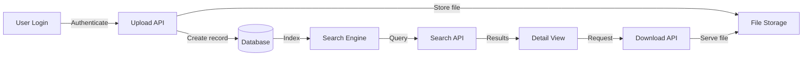
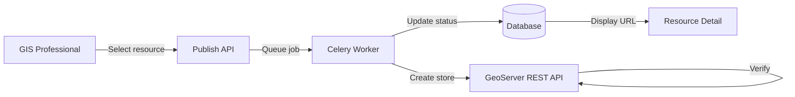

# GeoSpatial Resource Platform — Trace Bullets

Version: 1.0

Status: Draft

Purpose:
Identify the riskiest unknowns and define minimal end-to-end implementations to validate them early.

---

# Trace Bullet 1 — Core Resource Lifecycle

## Risk

The complete resource flow (upload → store → search → view → download) spans multiple modules. Integration issues may surface late if modules are built in isolation.

## Objective

Validate end-to-end resource lifecycle across all major platform subsystems.

## Path

## Verification

- User logs in successfully
- File upload creates a resource with metadata
- Resource appears in search results
- Resource detail page loads with correct data
- Authorized user can download the file
- Unauthorized user is denied

## What This Validates

- Authentication and session management
- File upload pipeline (validation → storage → record creation)
- Metadata extraction from uploaded files
- Search indexing and query
- Permission enforcement at API level
- File download with access control

---

# Trace Bullet 2 — Resource Publishing to GeoServer

## Risk

GeoServer integration is the most complex external dependency. The REST API, store/layer creation, style management, and error handling may have unanticipated issues.

## Objective

Validate end-to-end publishing of a vector dataset as WMS and WFS.

## Path

## Verification

- GIS Professional can trigger publishing from the UI
- Celery job executes and creates a GeoServer store
- GeoServer layer is created and accessible
- WMS GetCapabilities includes the new layer
- WFS returns features from the published dataset
- Publishing status is displayed in the platform
- Publishing failure is handled gracefully

## What This Validates

- Celery job infrastructure
- GeoServer REST API integration
- Publisher abstraction interface
- Error handling for external system failures
- Publishing status tracking

---

# Trace Bullet Execution Strategy

1. Build Trace Bullet 1 first (it validates the core platform)
2. Once complete, build Trace Bullet 2 (it validates the most complex external integration)
3. If either trace bullet reveals architectural problems, fix before expanding scope

## Success Criteria for Trace Bullets

- All verification steps pass
- No architectural changes required as a result of the trace bullet
- Implementation effort for remaining features is predictable
